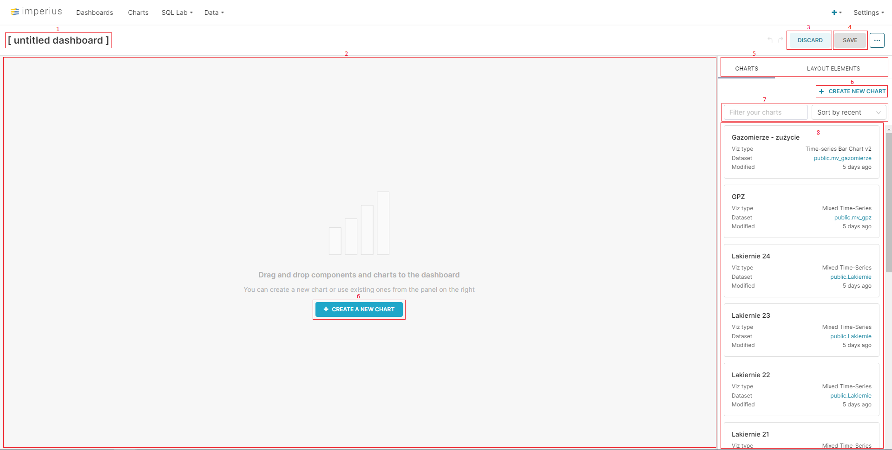

# Dashboard

## Dodawanie nowego dashboardu
Ekran tworzenie nowego dashboardu

1. Nazwa dashoardu - podwójne kliknięcie umożliwia zmianę
2. Miejsce na dodanie wykresów
3. Przycisk usuwający wszelkie wprowadzone dane
4. Przycisk zapisujący dashboard
5. Przełączanie pomiędzy wykresami a elementami układu
6. Przycisk umożliwiający stworzenie nowego wykresu
7. Filtrowanie i sortowanie elementów znajdujących się poniżej
8. Lista dostępnych wykresów

Dodawanie wykresów do dashboardu następuję poprzez przeciągnięcie elementu z listy (pkt. 8) do głównego okna (pkt. 2). Kolejność wykresów może być dowolnie modyfikowana. 