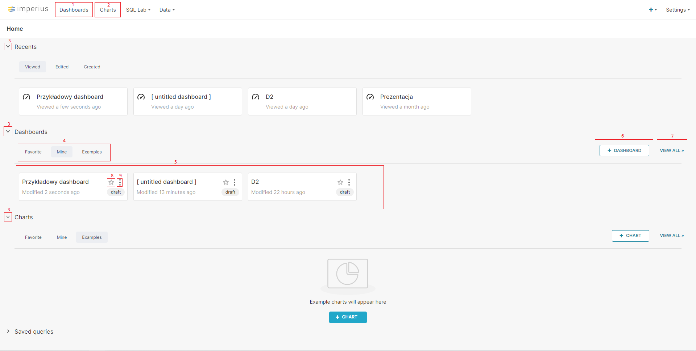

# Ekran główny

Poniżej widoczny jest przykładowy ekran główny.

1. Przejście do listy dashboardów
2. Przejście do listy wykresów
3. Rozwijanie/zwijanie grupowania
4. Wybór jakie elementy mają zostać wyświetlone:
   * Favorite - dodane do ulubionych
   * Mine - stworzone przez użytkownika
   * Examples - przykładowe
5. Miejsce wyświetlania elementów - kliknięcie w element pozwala przejść do danego elementu
6. Przycisk dodający nowy element
7. Przejście do listy elementów
8. Kliknięcie w gwiazdkę dodaje element do ulubionych
9. Najechanie kursorem w to miejsce rozwinie menu pozwalające na wybór: 
   * Edit - edycja elementu
   * Export - Wyeksportowanie elementu
   * Delete - Usunięcie elementu 
