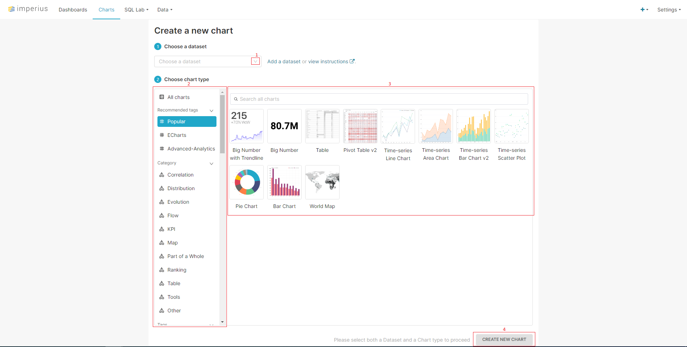
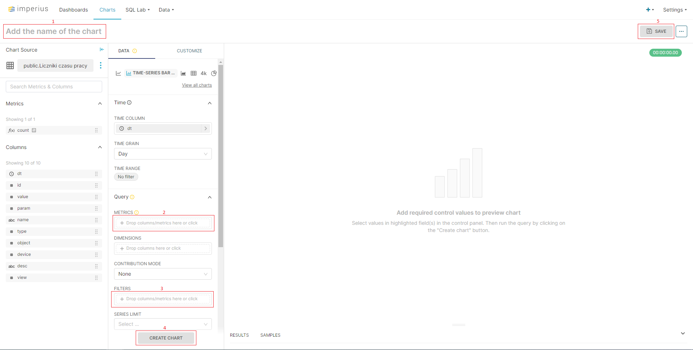

# Wykres

## Dodawanie nowego wykresu

Dodawanie wykresu jest dwustopniowe. Powyżej prezentowany jest pierwszy krok. Po kliknięciu w przycisk oznaczony pkt. 1 rozwinięta zostanie lista zbiorów danych gdzie należy wybrać jedną. Następnie należy wybrać w jaki sposób mają być prezentowane dane. Lewa strona (pkt. 2) pozwala na wybór kategorii, a prawa (pkt.3) na dokładny wygląd wykresu. Przycisk na dole strony (pkt. 4) pozwala na przejście do kolejnego kroku.

Na kolejnej stronie można dodać nazwę wykresu poprzez dwukrotne kliknięcie pola na górze ekranu (pkt. 1). Lewa strona pozwala sprecyzować jakie dane będą prezentowane (pkt. 2), oraz w jaki sposób będą filtrowane (pkt. 3). Wciśnięcie przycisku (pkt. 4) utworzy wizualizację po prawej stronie. Kliknięcie przycisku w prawym górnym rogu ekranu (pkt. 5) kończy proces tworzenia wykresu.    