# Instrukcja użytkownika

## Wprowadzenie

W budynku zaprojektowano Platformę FM w oparciu o oprogramowanie imperius FM firmy PROMAR Sp. z o. o. Platforma ta tworzy jednolite środowisko ale realizuje funkcjonalności następujących narzędzi (modułów): 

* Moduł AIM - czyli zorientowana obiektowo baza danych, zawierającą wszelkie niezbędne dla zarządzania majątkiem trwałym informacje o każdym elemencie budowli czy infrastruktury. Moduł zawiera dane graficzne i nie graficzne, dokumenty i metadane a jego celem jest konsekwentne zarządzanie obiegiem informacji w całym cyklu życia obiektu. 
* Moduł CMMS wspomagający utrzymanie ruchu. Głównym jego zadaniem jest pomoc w planowaniu przeglądów i konserwacji urządzeń i instalacji technicznych. Podstawowym modułem programu są rejestry obsługiwanych urządzeń i instalacji wraz z ich wymaganiami technicznymi (rejestry maszyn, podzespołów, urządzeń, instalacji). Moduł umożliwia wizualizację urządzeń na planach budynku w oparciu o model BIM. Moduł zawiera również rejestr wykonawców przewidzianych do realizacji zadań utrzymania ruchu w tym dane kontaktowe, specjalizacje, dostępność oraz szczegóły zapisów umowy.  Moduł CMMS umożliwia również wprowadzanie interwencji nieplanowanych, generowanie tygodniowych planów pracy oraz poleceń pracy dla poszczególnych specjalistów. 
* Moduł EMS - Zawiera opis wszystkich systemów dostaw i dystrybucji mediów w obiekcie uwzględniając wszystkie liczniki zarówno te rzeczywiste jak i liczniki wirtualne. System EMS bazuje na odczytach rzeczywistych z wszelkich liczników mediów energetycznych i wody. Moduł posiada funkcje wielopłaszczyznowej prezentacji umożliwiając modelowanie i porównywanie rozwiązań oraz prezentowanie parametrów podlegających ocenie. 
* Moduł CAFM stanowi wsparcie zarządzania obiektem na etapie eksploatacji. Zawiera opis obiektu, opis organizacji, struktury i osób/użytkowników. Opis obejmuje wszystkie pomieszczenia wraz z ich danymi dotyczącymi powierzchni, typu podłoża, itp. Umożliwia przypisanie konkretnego pomieszczenia konkretnemu użytkownikowi, co daje możliwość generowania zestawień zajętości, powierzchni wydziałów, biur, średnich. Moduł zawiera również opisy wszystkich usług świadczonych na rzecz użytkowników (na jakich zasadach, zapisy umów.) oraz informacje o wykonawcach usług. Moduł posiada również funkcje rezerwacji zasobów (sal konferencyjnych, mebli, urządzeń przenośnych, rzutników, ekranów, floty) jak również funkcje automatycznego generowania poleceń pracy dla ekip sprzątających sale konferencyjne po użyciu.

Platforma FM zainstalowana jest na serwerze znajdującym się w szafie serwerowej pomieszczenia 201. Do systemu zalogować się można z dowolnego komputera pracującego w sieci lokalnej (lub za pośrednictwem VPN) Urzędu Marszałkowskiego Województwa Zachodniopomorskiego.

## Instrukcja obsługi Platformy FM
Obsługą Platformy FM powinny zajmować się osoby przeszkolone z zakresu obsługi wdrożonego systemu.

### Uruchomienie środowiska
Dostęp do Platformy FM możliwy jest z dowolnego komputera pracującego w sieci lokalnej UMWZP (komputery służbowe pracowników urzędu) lub z komputerów które łączą się zdalnie z wykorzystaniem autoryzowanego przez dział IT połączenia VPN. Dostęp do Platformy FM możliwy jest z poziomu przeglądarki internetowej i nie wymaga korzystania z dedykowanej aplikacji klienckiej. Platforma FM działa na najpopularniejszych przeglądarkach internetowych takich jak: 

* Przeglądarka internetowa Mozilla Firefox w wersji v. 93.0
* Przeglądarka internetowa Google Chrome w wersji v. 93.0
* Przeglądarka internetowa Opera w wersji v. 78.0
* Przeglądarka internetowa Microsoft Edge w wersji v. 94.0 
Aby rozpocząć korzystanie z Platformy FM w polu adresu przeglądarki internetowej należy wpisać adres http://10.30.30.10 (adres ten może ulec zmianie po przejęciu obiektu przez służby IT zamawiającego). 

### Logowanie do systemu
Po uruchomieniu środowiska Użytkownik systemu zostaje poproszony o zalogowanie się. Ekran logowania przedstawia poniższy obraz.
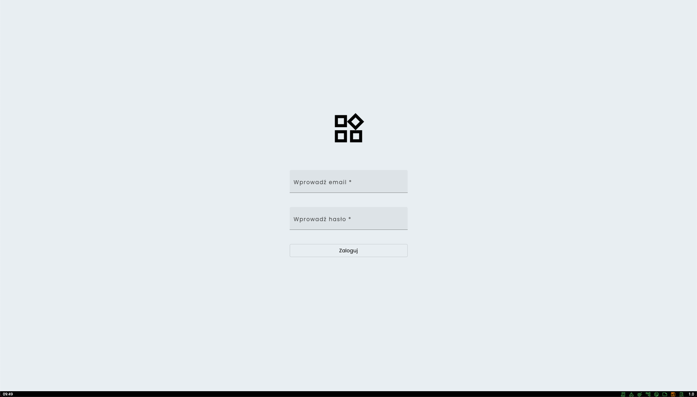
Aby zalogować się do systemu należy wprowadzić login oraz hasło a następnie kliknąć na przycisk [Zaloguj]. Login użytkowników którzy są pracownikami UMWZP składa się z pierwszej litery imienia oraz z nazwiska i posiada domenę umwzp.local. Dla użytkownika Jan Kowalski login wygląda następująco: **jkowalski@umwzp.local**  
Administratorami dostępu do Platformy FM dla użytkowników wewnętrznych UMWZP są pracownicy Wydziału Informatyki.
Hasło służące do logowania w przypadku użytkowników wewnętrznych jest tym samym które służy do logowania do systemu operacyjnego na komputerach służbowych.
W przypadku problemów z logowaniem należy zwrócić się o pomoc do Wydziału Informatyki 
Dla użytkowników zewnętrznych którzy nie są zatrudnieni w UMWZP (np. pracownicy firm sprzątających) administratorami danych logowania są pracownicy Wydziału Administracji. Aby otrzymać login i hasło do Platformy FM należy się zwrócić o ich nadanie oficjalną drogą do pracowników tego wydziału. 

#### Zmiana hasła przy pierwszym logowaniu
Użytkownicy zewnętrzni którzy pierwszy raz logują się do platformy zostaną poproszeni o ustawienie własnego Hasła. Ekran zmiany hasła przedstawiono na poniższym obrazie:
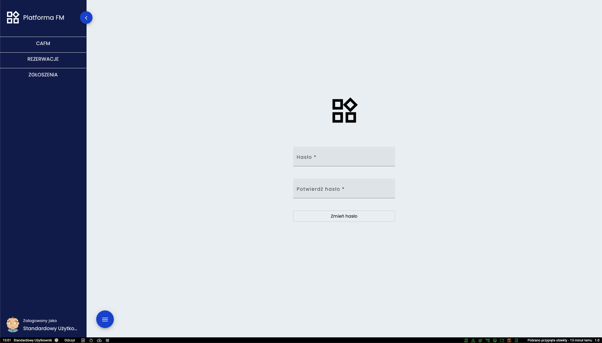
Aby zmienić istniejące hasło, należy w obu polach wprowadzić nowe hasło a następnie wcisnąć przycisk [Zmień hasło]. 
Nowe hasło musi być zgodne z polityką bezpieczeństwa, czyli:

* musi zawierać minimum 8 znaków
* musi posiadać przynajmniej jedną małą literę
* musi posiadać przynajmniej jedną wielką literę
* musi posiadać znak specjalny

Jeśli nowe hasło nie posiada powyższych właściwości to nie zostanie przyjęte przez system.

### Podstawy obsługi interfejsu
Po zalogowaniu użytkownik otrzymuje dostęp do panelu zbliżonego do tego który został przedstawiony na poniższym obrazie.
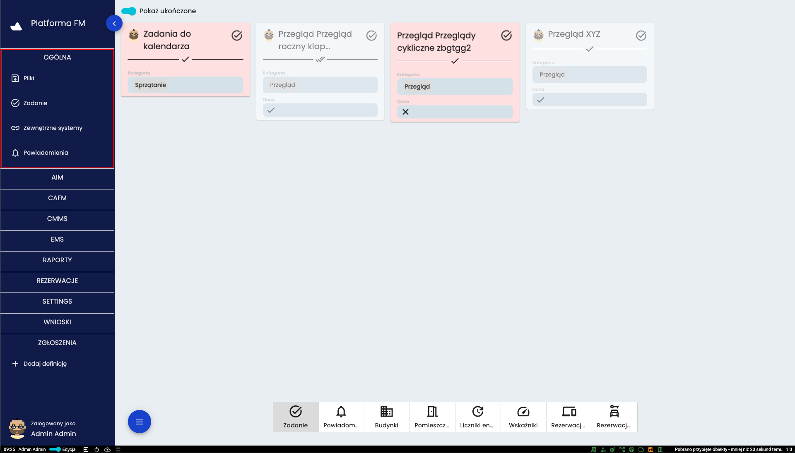
W lewej części interfejsu w granatowym polu znajdują się główne narzędzia platformy które zostały pogrupowane a każdą z
grup można rozwijać poprzez kliknięcie na jej nazwę. Po zalogowaniu zawsze rozwinięta jest grupa *OGÓLNE* i taki widok został przedstawiony na powyższym obrazie a grupa ta zaznaczona została czerwoną ramką. 
<figure markdown>
  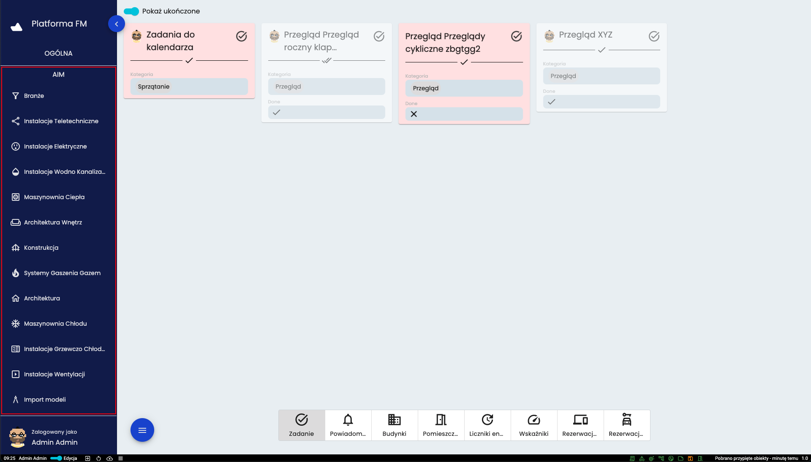
  <figcaption>Grupa AIM</figcaption>
</figure>
<figure markdown>
  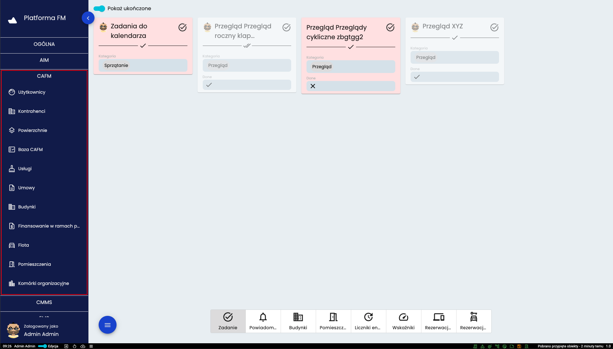
  <figcaption>Grupa CAFM</figcaption>
</figure>
<figure markdown>
  
  <figcaption>Grupa CMMS</figcaption>
</figure>
<figure markdown>
  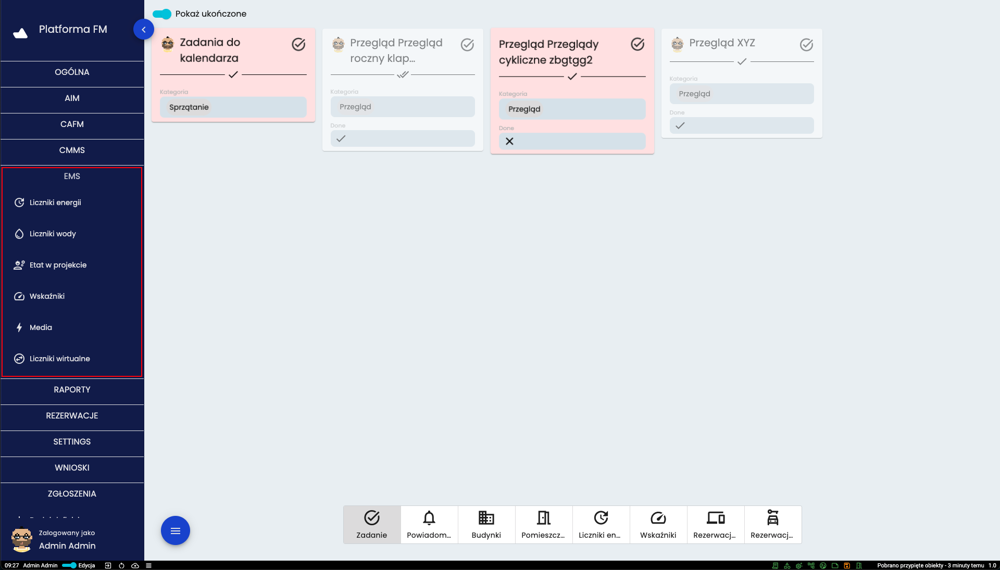
  <figcaption>Grupa EMS</figcaption>
</figure>
<figure markdown>
  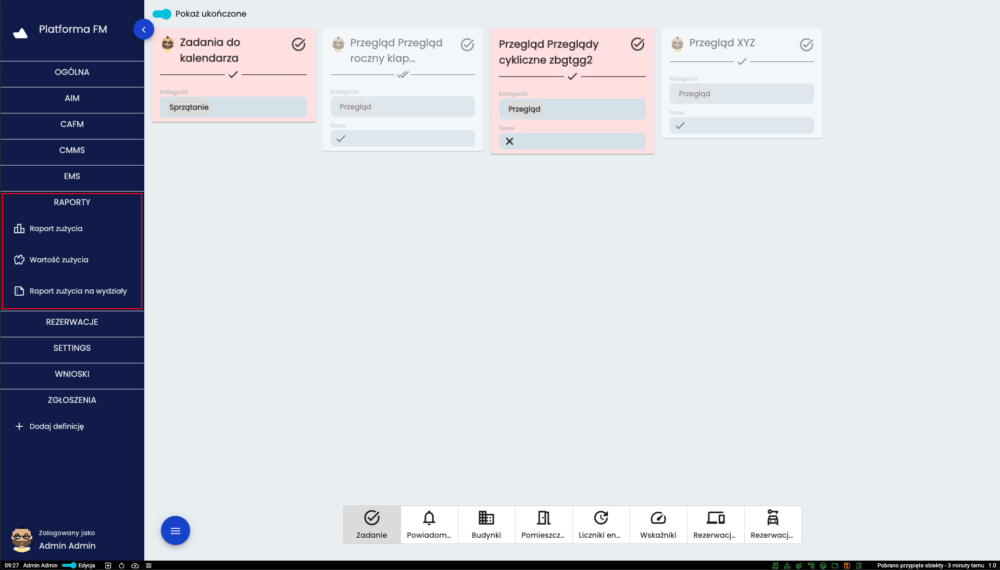
  <figcaption>Grupa RAPORTY</figcaption>
</figure>
<figure markdown>
  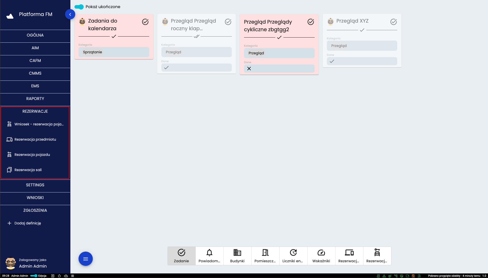
  <figcaption>Grupa REZERWACJE</figcaption>
</figure>
<figure markdown>
  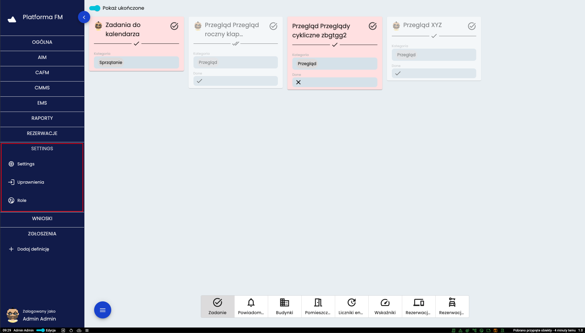
  <figcaption>Grupa SETTINGS</figcaption>
</figure>
<figure markdown>
  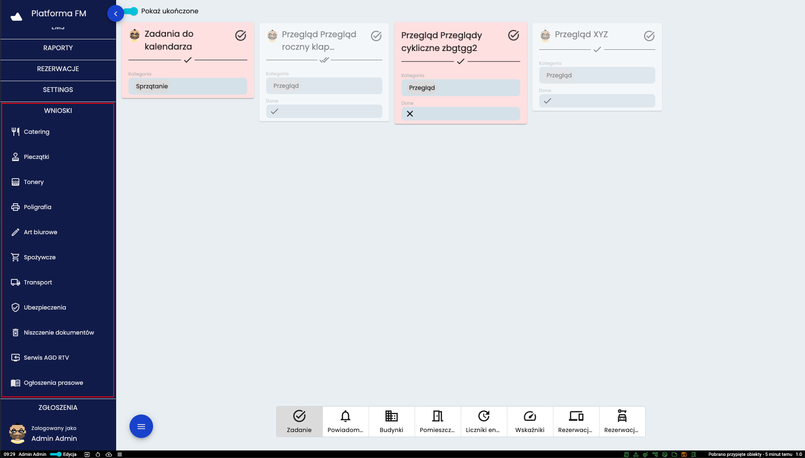
  <figcaption>Grupa WNIOSKI</figcaption>
</figure>
<figure markdown>
  
  <figcaption>Grupa ZGŁOSZENIA</figcaption>
</figure>

Powyższe obrazy przedstawiają pełne menu Platformy FM, jednak jest w tej postaci jest ono dostępne jedynie użytkownikom o
roli administratora. Ilość dostępnych narzędzi jest różna w zależności od roli posiadanej przez użytkownika. Dla 
przykładu - menu widoczne z punktu widzenia standardowego użytkownika przedstawione zostało na poniżej
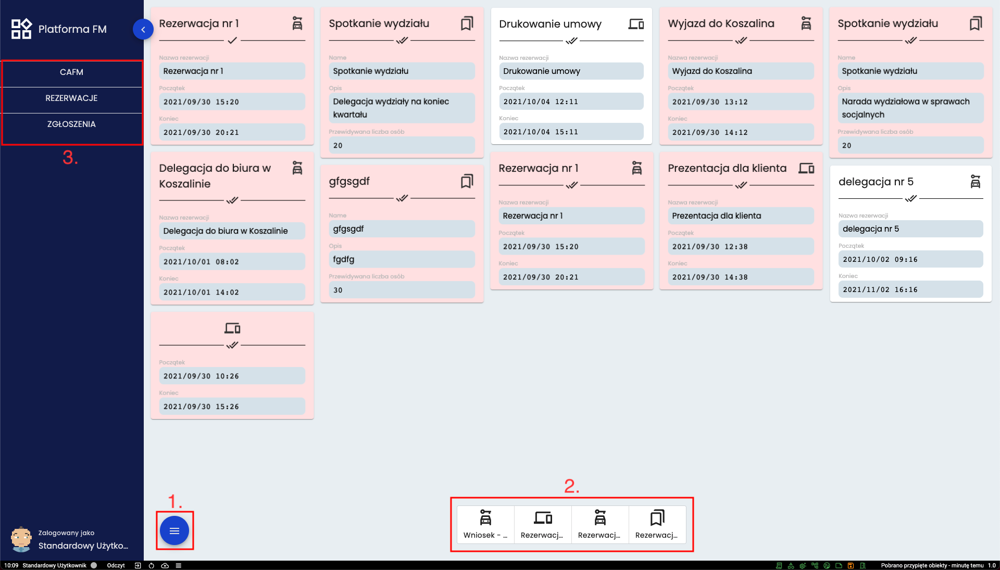
W ramce o numerze **3.** oznaczono skróconą listę narzędzi widoczną dla użytkownika o roli *“Standardowy użytkownik”*.
Głównym elementem interfejsu jest *panel użytkownika* czyli zbiór kart które użytkownik wybrał do obserwowania (zostanie to omówione w dalszej części instrukcji) lub są do tego użytkownika przydzielone (w formie zadań, rezerwacji lub innych 
powiązań), czyli dane z systemu można dodać samodzielnie lub zostają przypisane przez system. W przypadku kart zadań mogą 
mieć one kilka stanów. Kolor czerwony oznacza, że minął termin wykonania. Wyszarzona karta wskazuje, że zadania zostało 
ukończone. Oznaczony na obrazie przycisk oznaczony numerem **1.** to przycisk służący do rozwinięcia menu pomocniczego.
Pod numerem **2.** oznaczono filtry pozwalające wybrać jakiej grupy mają być wyświetlane karty. 