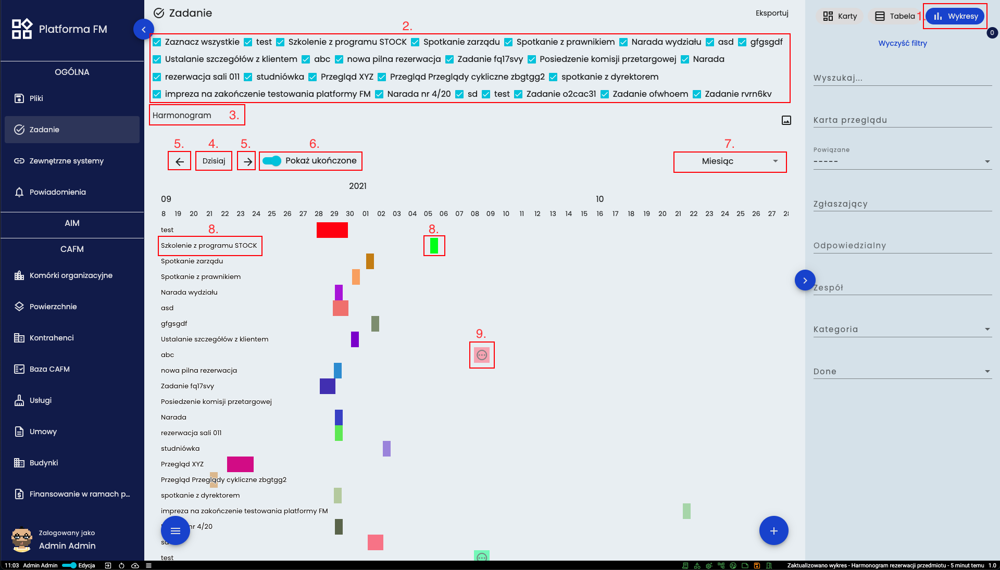
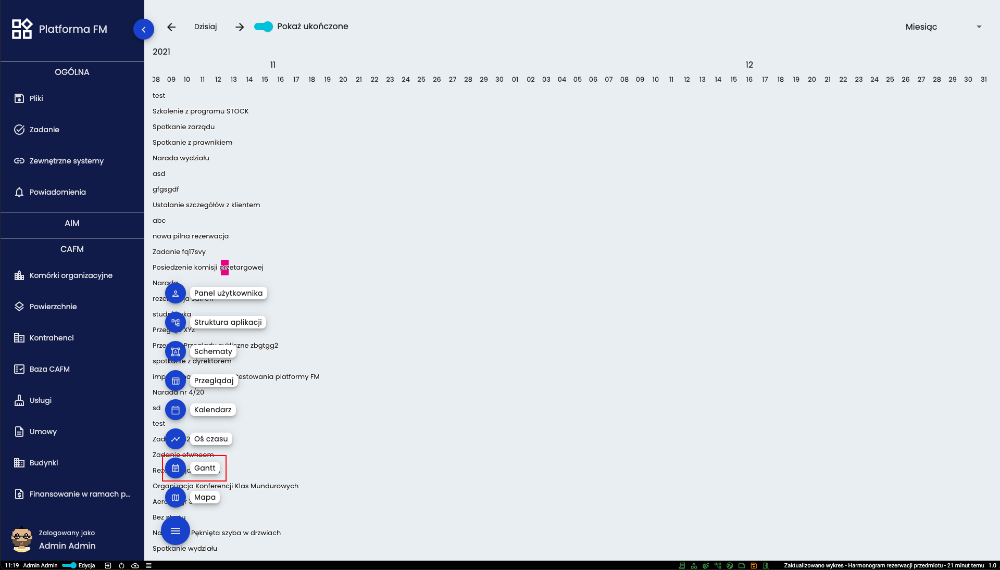
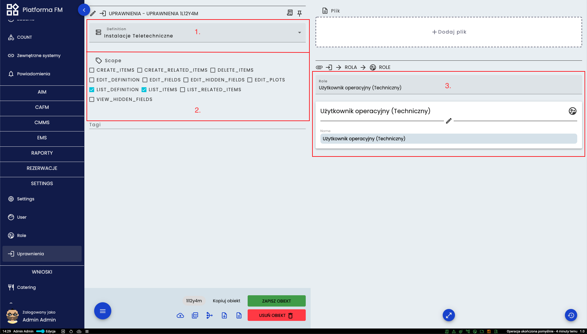
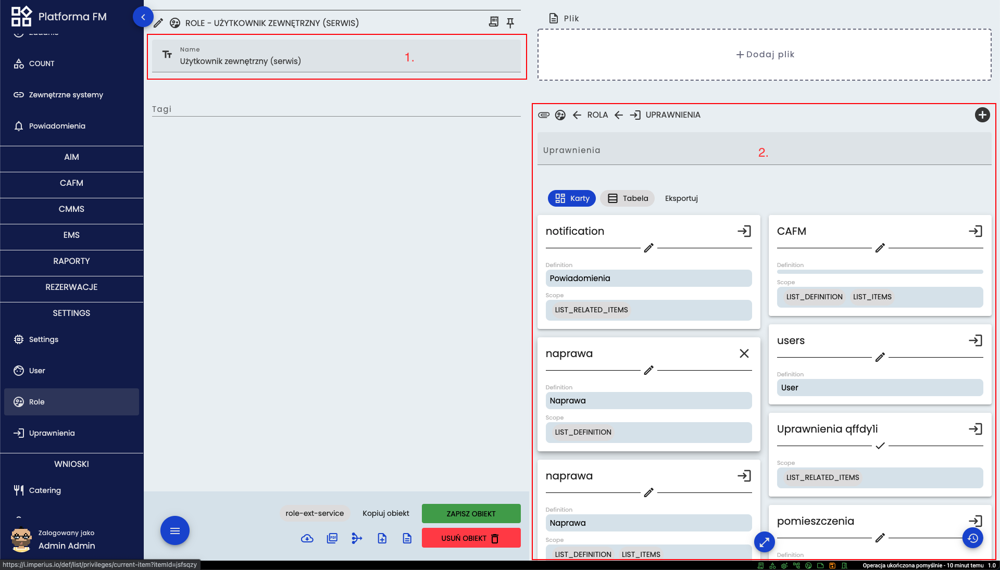

# Użytkownik zarządzający

## Zadania
Do skutecznego zarządzania zadaniami oraz ich umiejscowieniem na osi czasu (przydzielenia pracownikom w wyznaczonych
terminach) służy narzędzie Gantta. Jest ono dostępne z poziomu menu Zadania. Szczegóły zaznaczono na poniższej ilustracji

Diagram dostępny jest po przejściu do wykresów (**1.**) a następnie zaznaczeniu interesujących obiektów (**2.**). W lewej
górnej części (**3.**) wyświetlana jest nazwa nadana przy tworzeniu. Naciśnięcie przycisku (**4.**) spowoduje
przesunięcie wykresu do aktualnej daty. Przesuwać wykres można ręcznie dzięki strzałką (**5.**) lub scrollem myszki z
jednocześnie wciśniętym klawiszem SHIFT. Przełącznik (**6.**) pozwala na pokazywanie/ukrywanie zadań, które są już
wykonane. Po prawej stronie (**7.**) można wybrać jaki zakres ma mieć wykres. Przejście do szczegółów obiektu następuje
poprzez wciśnięcie nazwy (**8.**) lub kafelka (**8.**). 
Kafelki można przesuwać na osi czasu oraz rozciągać. Zadania, które nie mają daty rozpoczęcia lub zakończenia wyświetlony
będą miały taki symbol (**9.**) na kafelku. 

Istnieje również globalne narzędzie Gantta pozbawione narzędzi filtrowania i wyświetlające wszystkie zadania które
zostały wprowadzone do systemu

Aby wyświetlić diagramy dla wszystkich definicji należy otworzyć menu pomocnicze i kliknąć przycisk zaznaczony powyżej.
Kontrolowanie jest takie samo jak dla poprzedniego przykładu.

## Role i uprawnienia
Jak wspomniano na początku niniejszej instrukcji pracownicy mogą mieć różne uprawnienia w systemie wskutek posiadania
rożnych ról użytkownika.

W lewej górnej części (**1.**) wybiera się jakiej definicji ma dotyczyć uprawnienie oraz jaki ma mieć zakres (**2.**) Po
prawej stronie (**3.**) wybrać jaka rola będzie miała dane uprawnienie.

Rolą określamy zbiór uprawnień. W lewej górnej części (**1.**) znajduje się nazwa danej roli. Po prawej stronie (**2.**)
pokazane są wszystkie uprawnienia, które przypięte są do tej roli. Posiadając odpowiednie uprawnienia w tych samych
miejscach można wyedytować dane. 