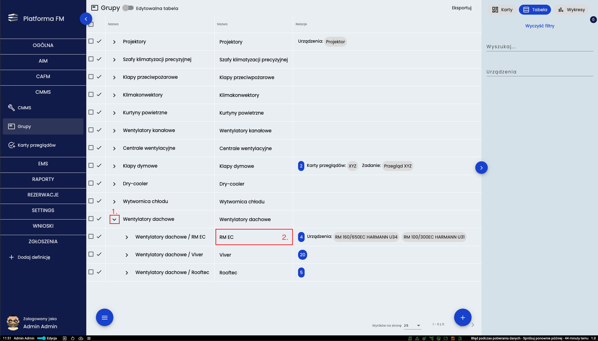
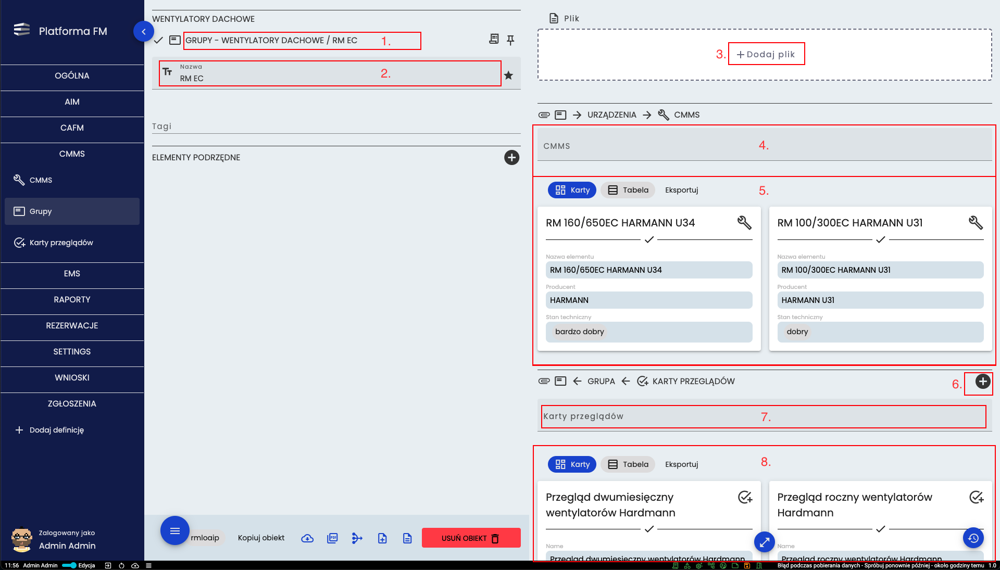
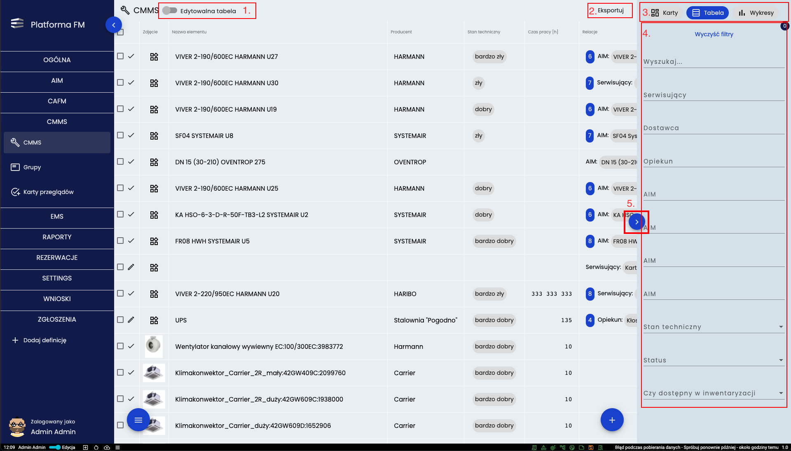
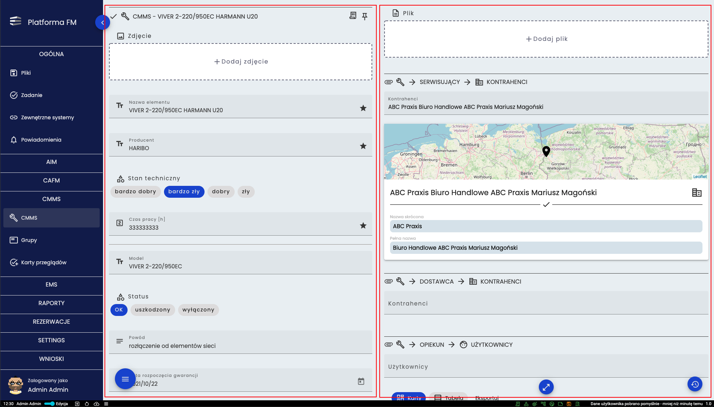
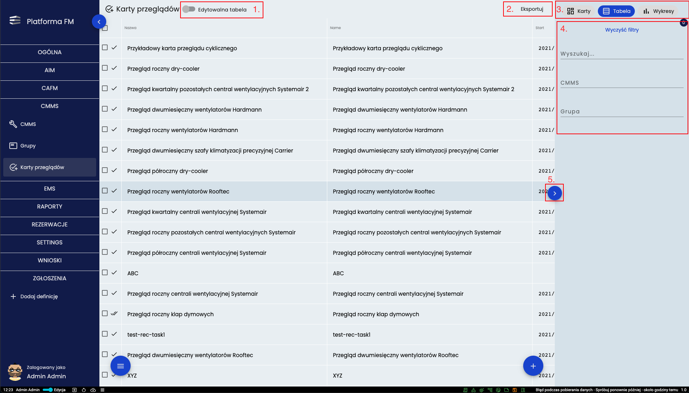
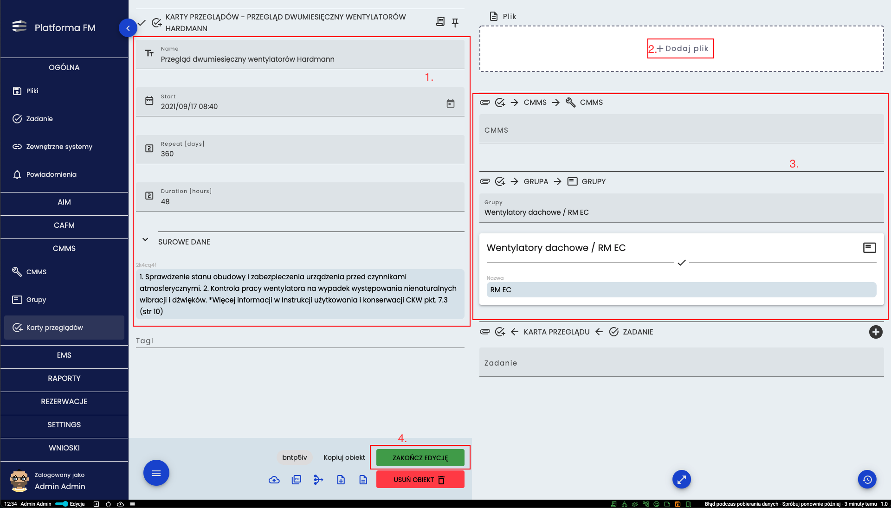
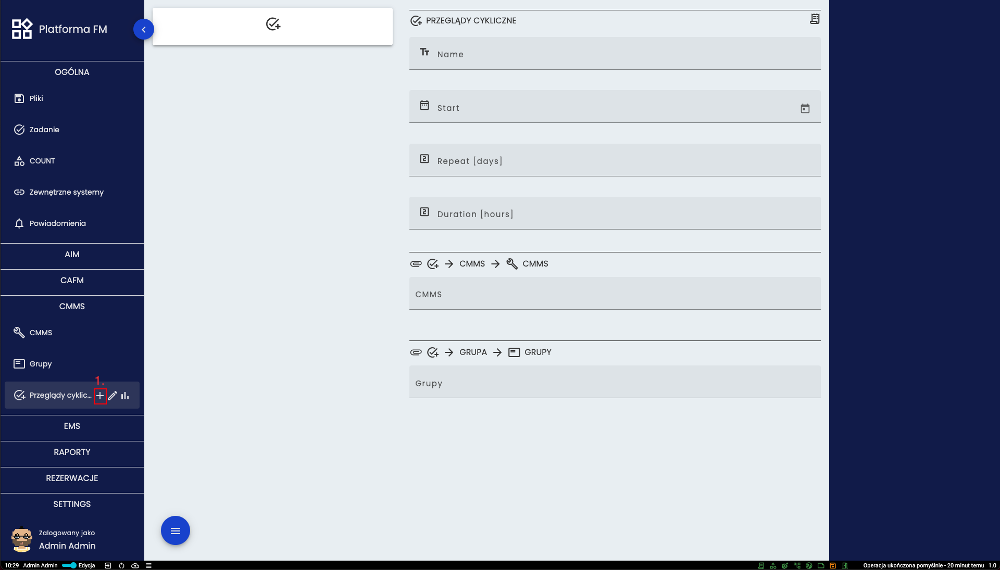
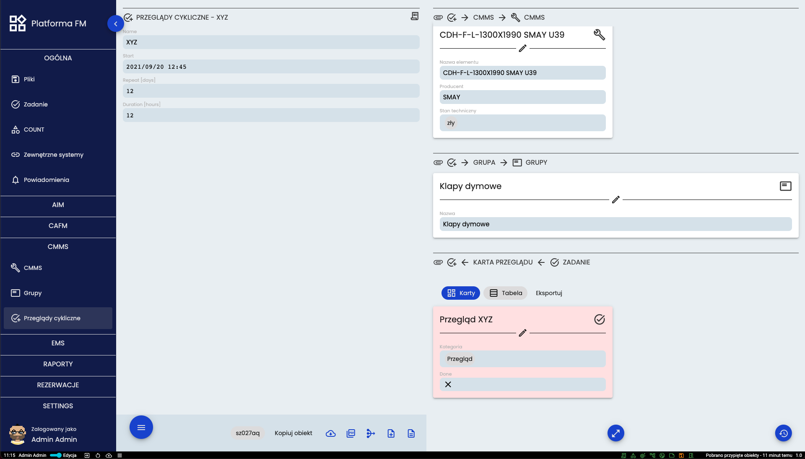

# Moduł CMMS

## Grupy i typy

Ważnym elementem modułu *CMMS* jest drzewo Grup i Typów które szereguje wszystkie elementy budynku zawarte w bazie
*CMMS*. Narzędzie “*Grupy*” prezentowane jest w postaci rozwijanego drzewa pokazują pogrupowane wszystkie dostępne Grupy i
Typy urządzeń. Za pomocą strzałki (**1.**) można rozwinąć daną grupę. Jeśli po jej kliknięciu nie pojawią się nowe
elementy to znaczy, że nie ma więcej podgrup i klikając w nazwę (**2.**) można przejść do szczegółów danej podgrupy.

Po wejściu w szczegóły zobaczyć można grupy nadrzędne (**1.**) Zmienić nazwę grupy (**2.**) Można dodać plik (**3.**)
Dodanie nowego urządzenia następuje poprzez wybranie go z rozwijanej listy (**4.**) Poniżej znajdują się karty urządzeń
(**5.**) już podpiętych do grupy. Nową kartę przeglądu można dodać za pomocą plusa (**6.**). Jeśli urządzenia z danej
grupy mają być brane pod uwagę przy istniejącym przeglądzie to należy wybrać przegląd z rozwijanej listy (**7.**) Poniżej
znajdują się karty przeglądów do których dana grupa jest już podpięta.

## CMMS
Jeśli użytkownik otworzy bazę urządzeń bezpośrednio z podmenu bocznego klikając podmenu *CMMS* otrzyma widok jak na
prezentowanym poniżej obrazie. Stanowi on widok bazy urządzeń w postaci tabeli.

Na górze znajduje się przełącznik (**1.**) pozwalający na edycję danych z widoku tabeli. Kolejny przycisk (**2.**)
pozwala na eksport danych w różnych formatach zależnie od wybranego typu pliku na rozwijanej liście. Sposób prezentowania
danych można zmienić w prawym górnym rogu (**3.**) przełączając się między widokiem w postaci kart a widokiem
tabelarycznym. Po prawej stronie znajdują się filtry (**4.**) pozwalające zawęzić pokazywane dane. Menu z filtrami może
zostać schowane przy użyciu przycisku (**5.**) po prawej stronie. 

Po wejściu w szczegóły urządzenia po lewej stronie widoczne są podstawowe informacje a wszystkie jego relacje po prawej 
stronie.

## Przeglądy
Kolejnym ważnym narzędziem modułu *CMMS* są karty przeglądów zawierające informacje o zakresie prac, częstotliwości w
jakich przeglądy powinny być realizowane, czasie jaki przeznaczony jest na realizację oraz urządzeniach które powinny być
objęte tymi przeglądami. Karty przeglądów znajdują się w jednej bazie i najwygodniej jest przeglądać je w formie
tabelarycznej jak pokazano na poniższym obrazie

Na górze znajduje się przełącznik (**1.**) pozwalający na edycję danych z widoku tabeli. Kolejny przycisk (**2.**)
pozwala na eksport danych w różnych formatach zależnie od wybranego typu pliku na rozwijanej liście. Sposób prezentowania
danych można zmienić w prawym górnym rogu (**3.**) przełączając się między widokiem w postaci kart a widokiem
tabelarycznym. Po prawej stronie znajdują się filtry (**4.**) pozwalające zawęzić pokazywane dane. Menu z filtrami może
zostać zwinięte przy użyciu przycisku (**5.**) po prawej stronie. 
Po wybraniu dowolnego wiersza w tabeli otwarta zostaje karta przeglądu której przykład zaprezentowano na kolejnym obrazie.

Po lewej stronie (**1.**) znajduje się miejsce na wprowadzenie podstawowych informacji o danym przeglądzie. Istnieje
możliwość dodania pliku (**2.**) Po prawej stronie (**3.**) można wybrać jakiego urządzenie/grupy dotyczyć ma przegląd.
Po kliknięciu w przycisk (**4.**) nie będzie możliwości wprowadzenia zmiany w danych oraz utworzone zostanie nowe zadanie
do którego przypisani zostaną wszyscy użytkownicy którzy posiadają rolę *Przegląd*.
Przeglądy utworzone w formie zadań rejestrowane są w bazie “*Zadania*” która jest narzędziem wspólnym dla wielu modułów
dlatego znajduje się w grupie “*OGÓLNA*” i zostanie omówiona w kolejnej części niniejszej instrukcji.

Osoba odpowiedzialna za tworzenie przeglądów cyklicznym robi to poprzez kliknięcie plusa (**1.**) przy nazwie definicji,
następnie uzupełnia pola po prawej stronie ekranu i klika kartę po lewej stronie na której pojawią się uzupełnione dane. 

Karta po zapisaniu i zakończeniu edycji przechodzi w tryb tylko do odczytu. Jednocześnie tworzone jest nowe zadanie,
które trafia na panele użytkowników posiadających role *Przegląd*. 