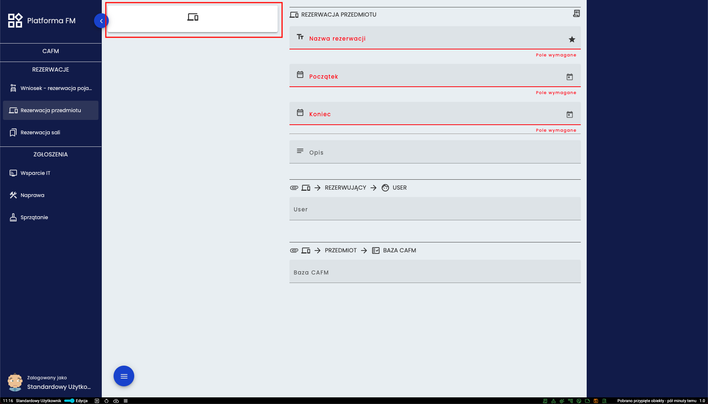
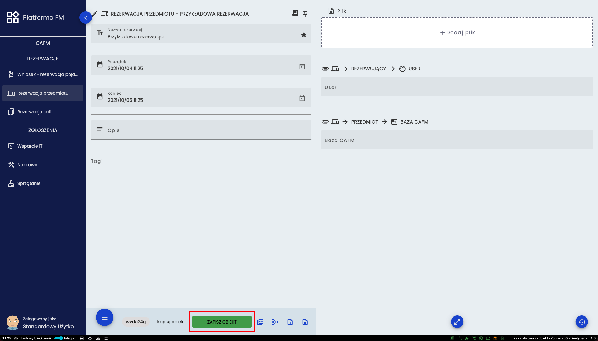
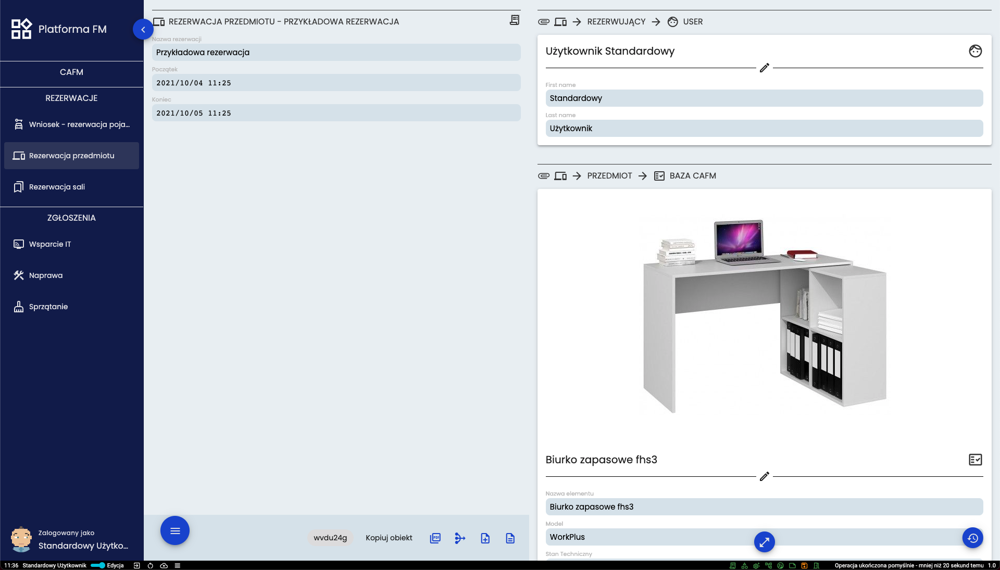
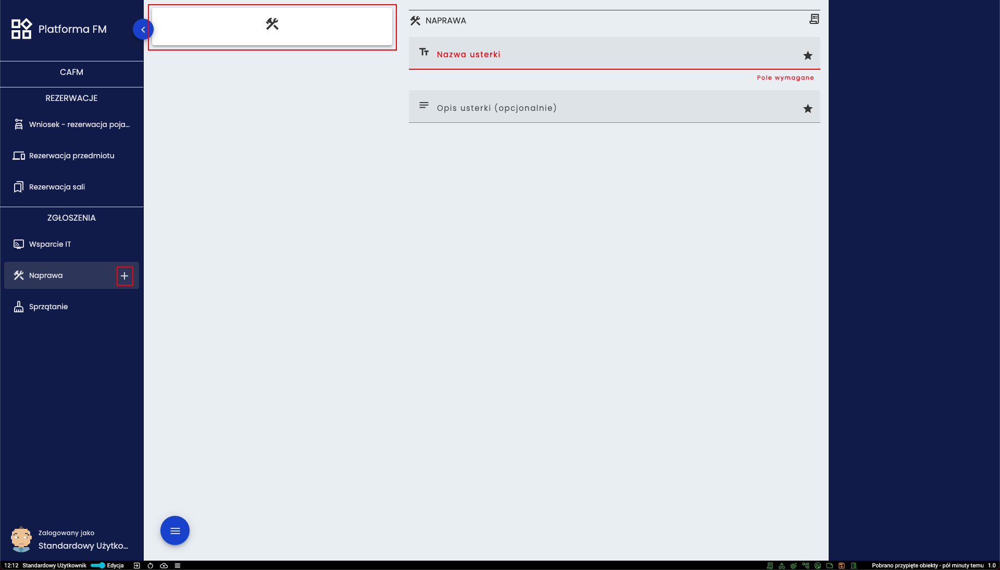
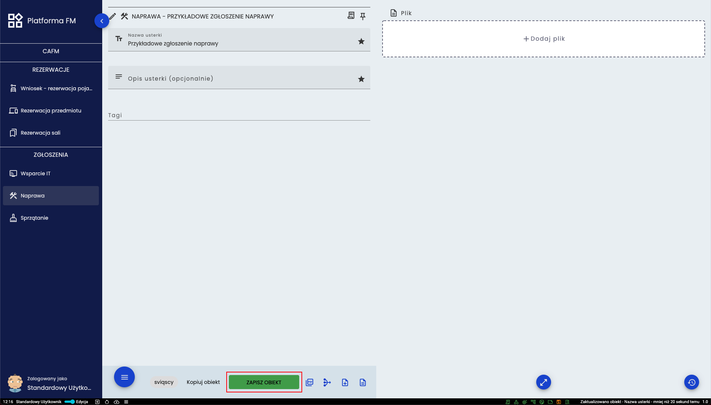
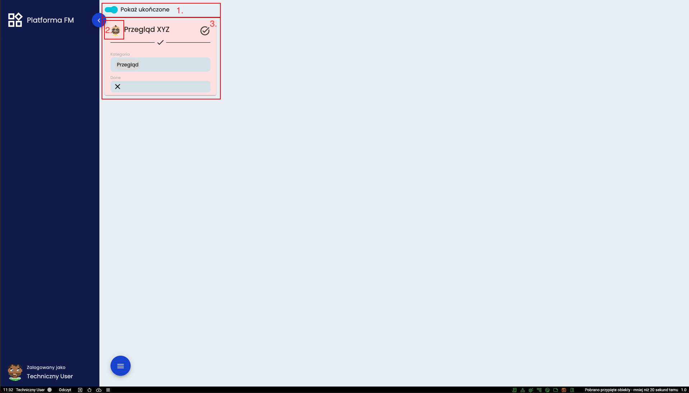
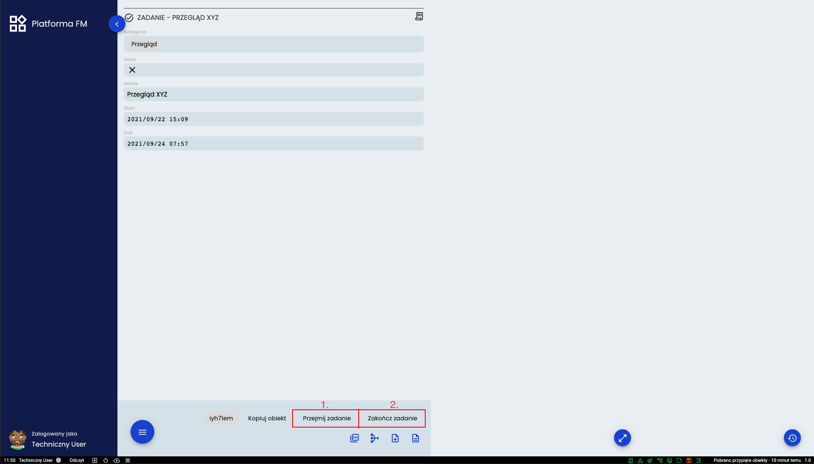
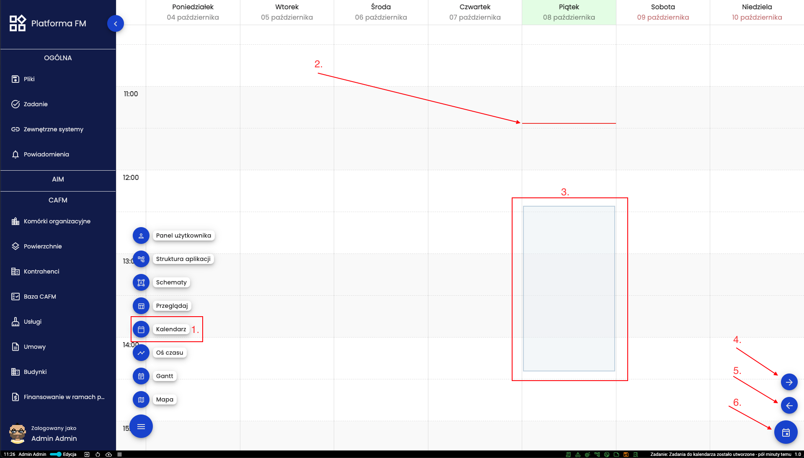
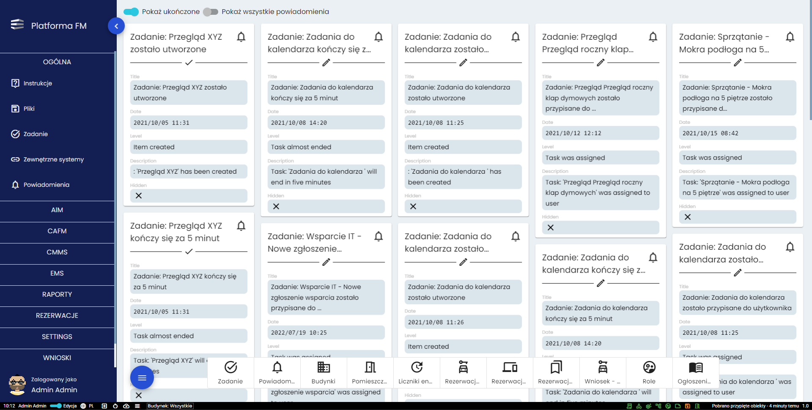
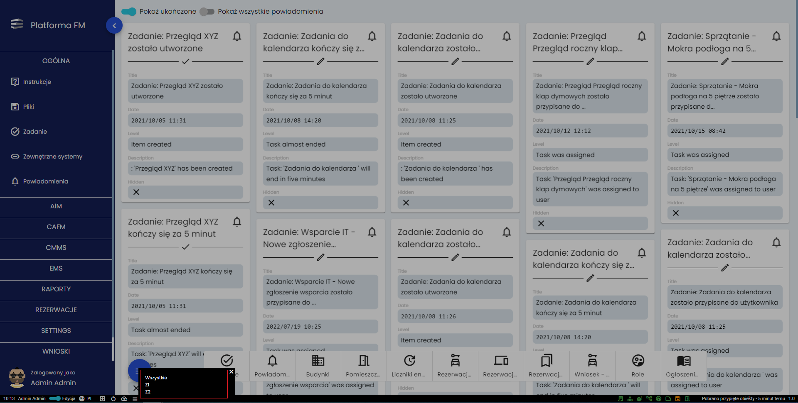

# Widok standardowego użytkownika

## Dodawanie rezerwacji 

Po najechaniu na nazwę rezerwacji pojawi się mała ikona plusa, którą należy kliknąć aby dodać nową rezerwację. Należy
wprowadzić odpowiednie dane, a następnie kliknąć kartę na której pojawią się te dane. Powyżej obramowana czerwonym
kolorem. Spowoduje to przeniesienie do szczegółów tworzonej rezerwacji. 

Powyżej widok do którego przechodzi się poprzez kliknięcie karty z poprzedniego przykładu. Po upewnieniu się, że
wprowadzone dane są poprawne należy kliknąć zielony przycisk ***ZAPISZ OBIEKT***. Jeśli nie ma żadnych błędów związanych
z wprowadzonymi danymi to przycisk zmieni napis na ***ZAKOŃCZ EDYCJĘ***. Aby rezerwacja trafiła do systemu należy kliknąć
powyższy przycisk a następnie to potwierdzić kolejnym kliknięciem przycisku zanim zniknie zielony pasek.
<figure markdown>
  
  <figcaption>Widok karty rezerwacji w systemie</figcaption>
</figure>
Dopiero po zakończeniu edycji karta rezerwacji zostanie wyświetlona na panelu użytkownika. 

## Dodawanie zgłoszenia

Dodawanie zgłoszenia jest bardzo podobne do dodawania rezerwacji. Należy kliknąć ikonę plusa przy nazwie zgłoszenia,
wprowadzić odpowiednie dane i kliknąć kartę zaznaczoną na czerwono na powyższym przykładzie.

Po kliknięciu na kartę i przejściu do powyższego widoku należy upewnić się, że wprowadzone dane są poprawnie a następnie
kliknąć przycisk ***ZAPISZ OBIEKT***. Jeśli nie ma żadnych błędów związanych z wprowadzonymi danymi to przycisk zmieni
napis na ***ZAKOŃCZ EDYCJĘ***. Aby zgłoszenie trafiło do systemu należy kliknąć powyższy przycisk a następnie to
potwierdzić kolejnym kliknięciem przycisku zanim zniknie zielony kolor.

## Obsługa zadań
Jeśli zadanie jest przydzielone do danego użytkownika to znajduje się w formie karty na jego panelu głównym jak pokazano
na poniższej ilustracji.

Na samej górze (**1.**) znajduje się przełącznik odpowiedzialny za wyświetlanie lub ukrywanie zadań zakończonych. Każde
zadanie to osobna karta(**3.**). Jeśli użytkownik przejmie zadanie to jego awatar pojawi się w lewym górnym rogu kart
(**2.**). Do obsługi zadań służą przyciski opisane na kolejnej ilustracji.

Widok na szczegóły karty zadania (dostępny po kliknięciu na kartę zadania). Na dole znajdują się przyciski do przejmowania
(**1.**) oraz do zakończenia danego zadania(**2.**). Zadania przydzielone do danego użytkownika pojawiają się również w
jego kalendarzu tworząc tygodniowy plan pracy jak przedstawione poniżej

## Kalendarz

Przejście do kalendarza następuje poprzez wciśnięcie przycisku (**1.**) na menu pomocniczym. Obecna data i godzina
oznaczona jest czerwoną poziomą kreską (**2.**) a występujące zadania wyświetlane są przy użyciu kafelek (**3.**)
Zadania, które nie zostały wykonane w czasie podświetlane są na czerwono, natomiast najechanie kursorem na kafelek
sprawia, że pojawia się karta ze szczegółami danego zadania. W prawym dolnym rogu znajdują się przyciski do kontrolowania
kalendarza. Od góry jest to przejście do następnego tygodnia (**4.**), przejście do poprzedniego tygodnia (**5.**) i
przeniesienie do dnia dzisiejszego (**6.**)

## Wybór budynku

Po kliknięciu w miejsce zaznaczone na czerwono znajdujące się na dolnej belce zostanie rozwinięte menu. 

Tutaj można wybrać z którego budynku dane mają być wyświetlane. Aby zamknąć menu należy skorzystać z białego krzyżyka w prawym górnym rogu menu, lub kliknąć gdziekolwiek poza menu.