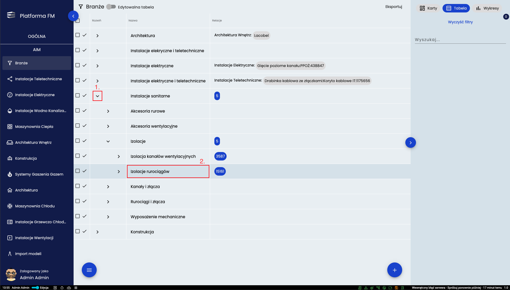
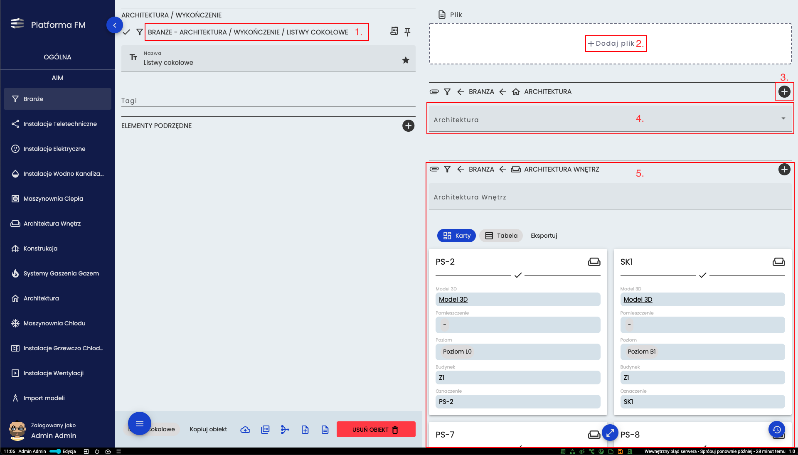
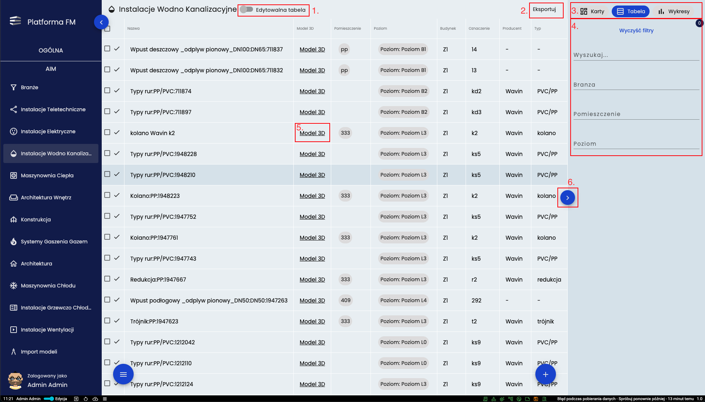
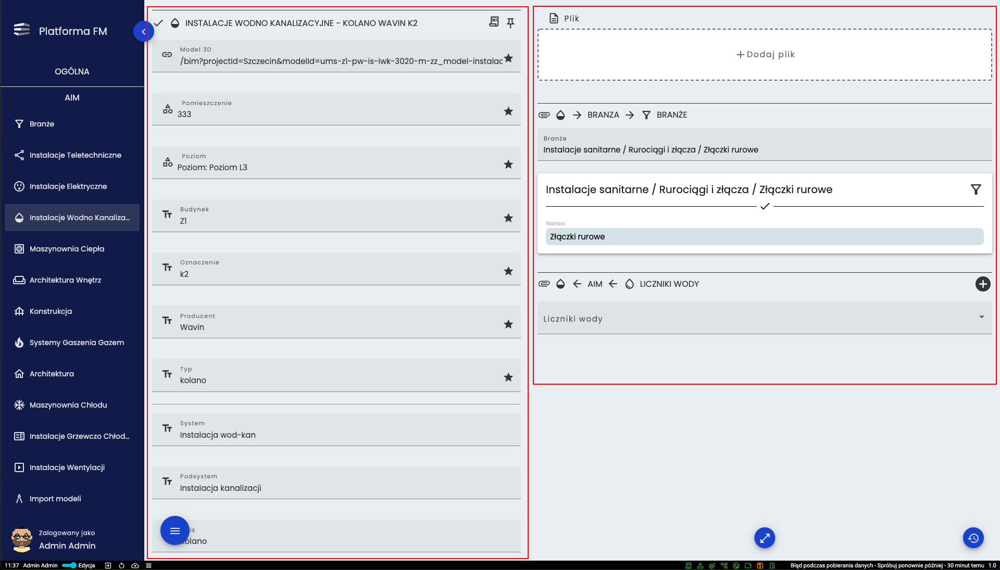
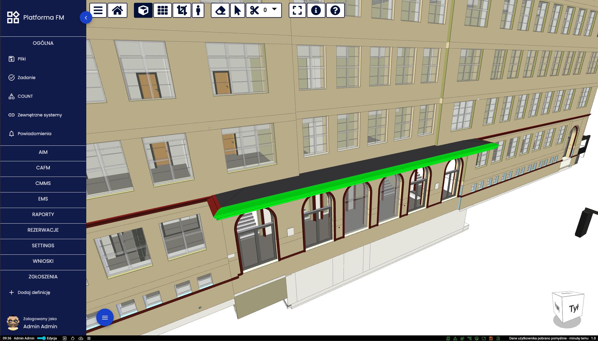
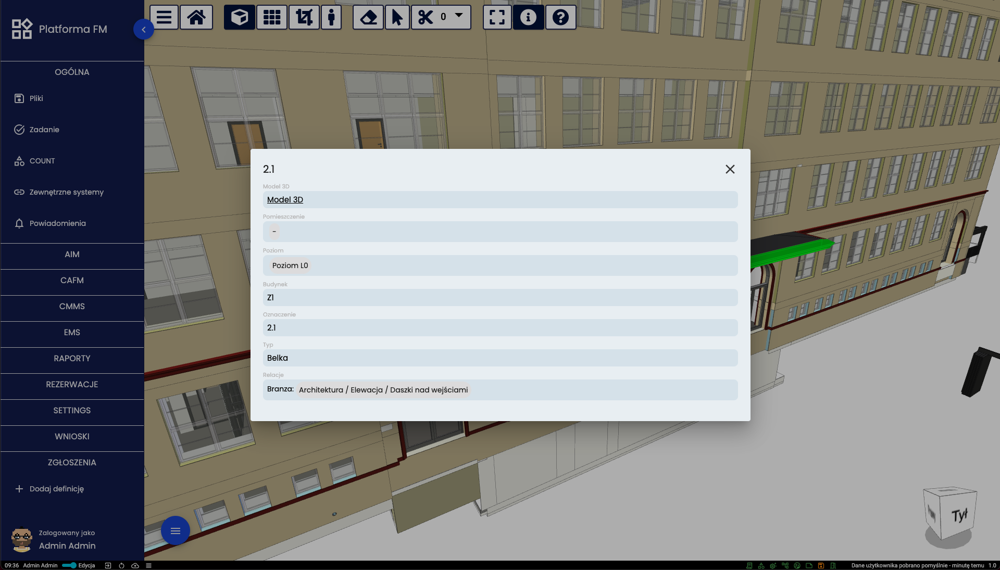

# Moduł AIM 
## Branże i kategorie
Ważnym elementem modułu AIM jest drzewo Branż i Kategorii które szereguje wszystkie elementy budynku zawarte w bazie AIM. 

Narzędzie “Branże” prezentowane jest w postaci rozwijanego drzewa pokazują pogrupowane wszystkie dostępne branże modułu
AIM. Za pomocą strzałki (**1.**) można rozwinąć daną grupę. Jeśli po jej kliknięciu nie pojawią się nowe elementy to
znaczy, że nie ma więcej podgrup i klikając w nazwę (**2.**) można przejść do szczegółów danej podgrupy.

Po wejściu w szczegóły zobaczyć można grupy nadrzędne (**1.**). Za pomocą przycisku nr (**2.**) możliwe jest dodanie pliku do aktualnie wybranej Branży, Kategorii lub Podkategorii. Elementy należące do danej podgrupy widoczne są pod nazwą branży do której należą (**5.**)

## Widok tabelaryczny i szczegółowy   

Jeśli użytkownik otworzy bazę elementów bezpośrednio z podmenu bocznego (w przedstawionym przykładzie - Instalacje Wodno 
Kanalizacyjne) otrzyma widok jak na prezentowanym powyżej obrazie. Stanowi on widok przykładowej branży w postaci tabeli 
elementów. Na górze znajduje się przełącznik (**1.**) pozwalający na edycję danych z widoku tabeli. Kolejny przycisk (**2.**) pozwala na eksport danych w różnych formatach zależnie od wybranego typu pliku na rozwijanej liście. Sposób
prezentowania danych można zmienić w prawym górnym rogu (**3.**) przełączając się między widokiem w postaci kart a
widokiem tabelarycznym. Po prawej stronie znajdują się filtry (**4.**) pozwalające zawęzić pokazywane dane. Kliknięcie
napisu Model 3D (**5.**) przy elemencie przeniesie użytkownika do wizualizacji 3D gdzie dany element zostanie
podświetlony. Menu z filtrami może zostać zwinięte przy użyciu przycisku (**6.**) po prawej stronie.

Po wejściu do dowolnego elementu bazy AIM podstawowe informacje znajdują się po lewej stronie natomiast wszystkie jego
relacje (powiązane elementy z innych narzędzi lub baz Platformy FM) znajdują się po prawej stronie.  Również na tych
kartach dostępny jest przycisk [Model 3D] który uruchamia widok trójwymiarowy danego elementu oraz jego umiejscowienie w
przestrzeni. Szczegóły tego narzędzia prezentowane są na następnych obrazach.

## Widok 3D

Obraz prezentuje widok po kliknięciu w przycisk Model 3D przy wybranym elemencie. Wybrany element wyróżniony jest kolorem zielonym. Przesuwanie widoku następuje poprzez ruch myszką z jednoczesnym przytrzymanie prawego przycisku myszy a obrót poprzez przytrzymanie lewego przycisku myszy. Można do tego wykorzystać również sześcian znajdujący się w prawym dolnym rogu ekranu.

Po wybraniu ikony z literą ”i” na górze ekranu i kliknięciu w jakiś element widoku pojawia się skrócona karta
informacyjna tego elementu. Po kliknięciu w tą kartę użytkownik zostanie przeniesiony do pełnej postaci karty elementu w
module AIM.