# Moduł CAFM

## Użytkownicy
Jednym z ważniejszych narzędzi modułu CAFM jest baza użytkowników/pracowników. Przykład takiej bazy zaprezentowano na
poniższym obrazie.
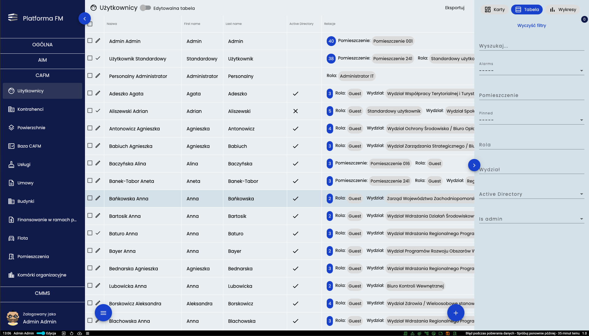
W menu *UŻYTKOWNICY* widoczni są wszyscy użytkownicy dodani do systemu. Kontrolowanie filtrów, eksportowanie czy inne 
podstawowe przyciski kontrolne znajdują się w standardowych miejscach i pełnią te  same funkcje jak opisane we
wcześniejszych modułach. 

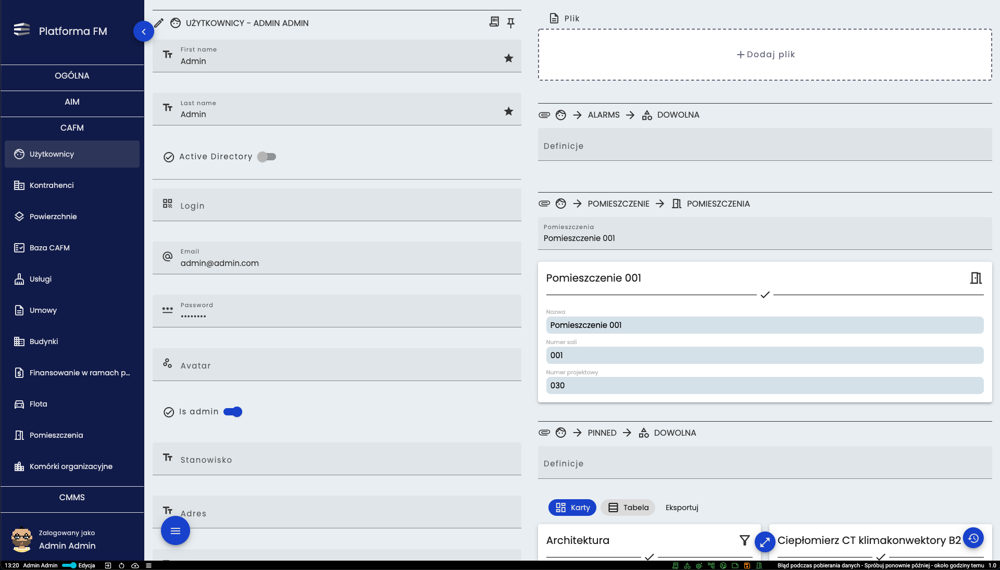
Po wejściu w szczegóły dowolnego użytkownika po lewej stronie wyświetlane są jego podstawowe informacje, natomiast po 
prawej stronie widoczne są wszystkie relacje do których jest podpięty czyli powiązania do innych elementów systemu (Np.
biuro do niego przydzielone).

## Kontrahenci
Kolejnym ważnym narzędziem w module CAFM jest baza kontrahentów. Jej przykład został zaprezentowany poniżej.
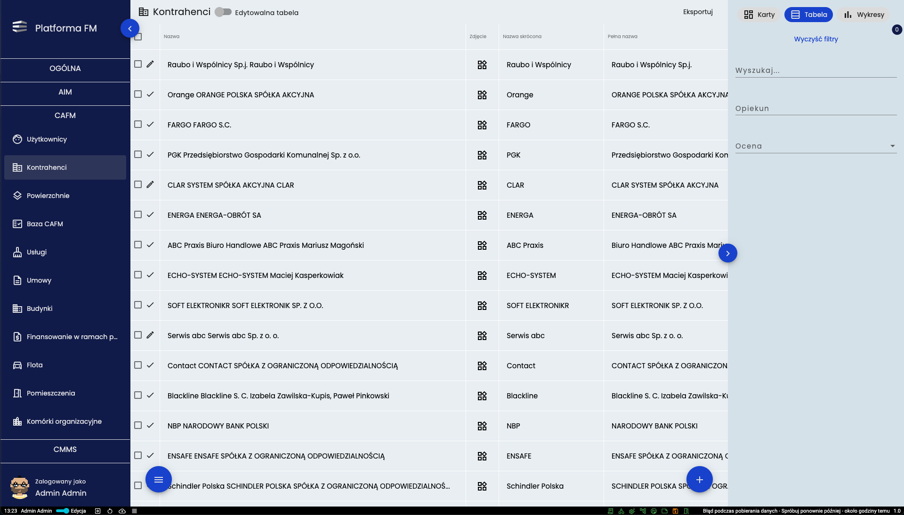
W bazie kontrahentów znaleźć się mogą wszystkie firmy realizujące usługi na rzecz UMWZP lub jego pracowników.
Kontrolowanie tego widoku przebiega w sposób standardowy podobny do opisanych wcześniej. 

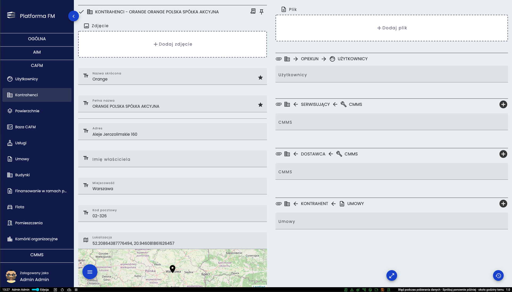
W szczegółach kontrahenta po lewej stronie widoczne są podstawowe informacje takie jak adres, nr telefonu czy godziny 
pracy. Po prawej stronie widoczne są jego relacje. 

## Powierzchnie
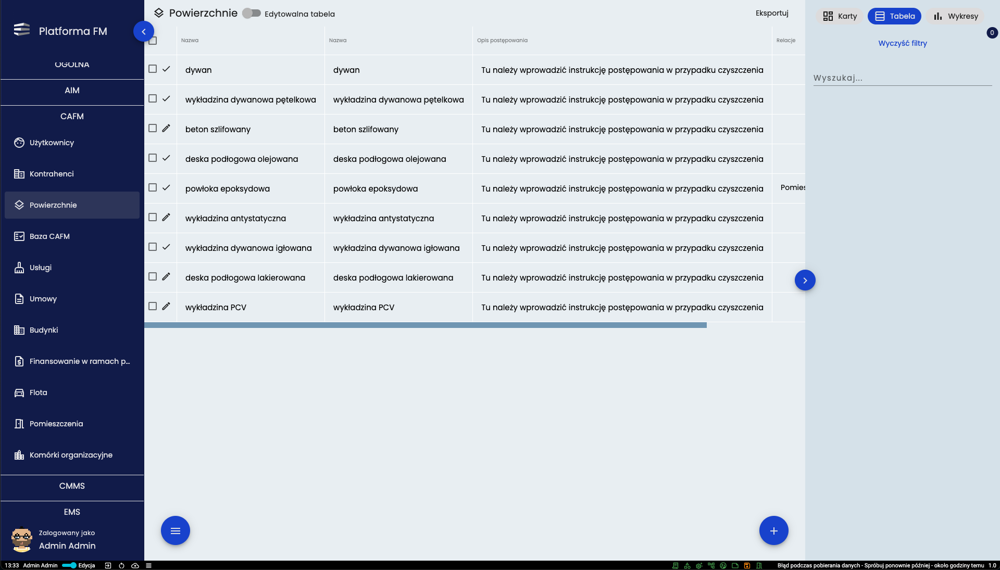
W powierzchniach znajduje się lista z rodzajami podłóg. Wszystkie kontrolki znajdują się w standardowych miejscach. 

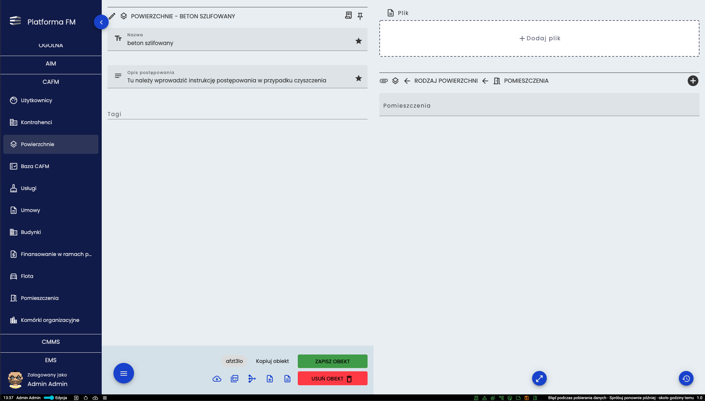
W szczegółach wybranej powierzchni po lewej stronie można zobaczyć jaka jest nazwa oraz w jaki sposób dana powierzchnia
powinna być czyszczona. Po prawej stronie widać w jakich pomieszczeniach ta powierzchnia się znajduje. 

## CAFM
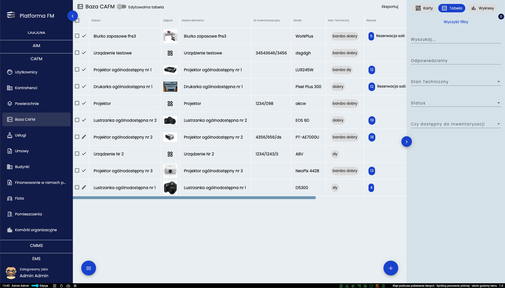
W bazie CAFM widoczne są wszystkie przedmioty wprowadzone do systemu.

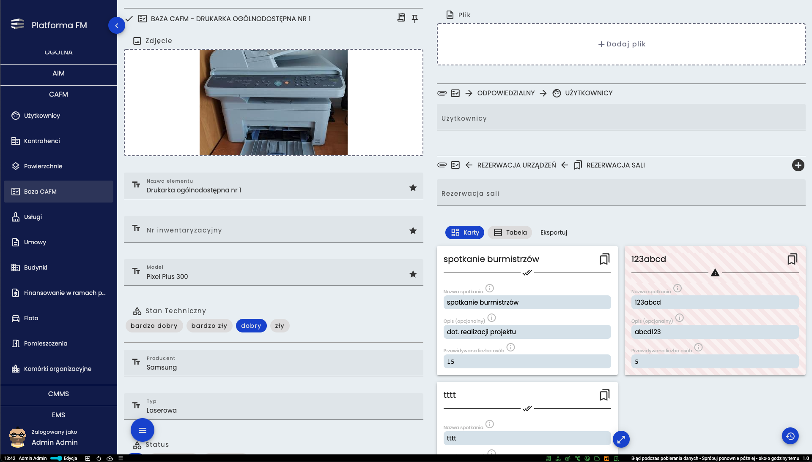
W szczegółach przedmiotu po lewej stronie znajdują się podstawowe informacje takie jak model, producent czy data końca 
gwarancji. Po prawej stronie sprawdzić można kto odpowiada za dany przedmiot oraz w jakich okresach będzie wypożyczony.

## Usługi
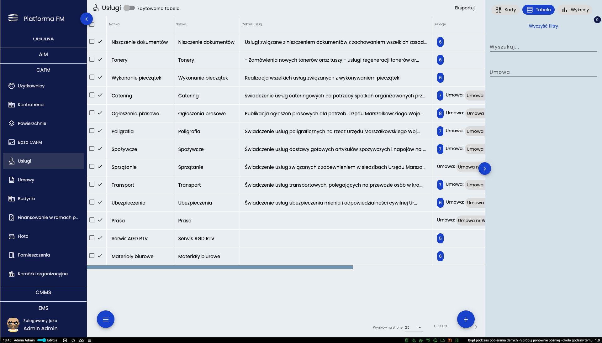
Usługi to baza świadczeń potrzebnych do codziennej pracy.

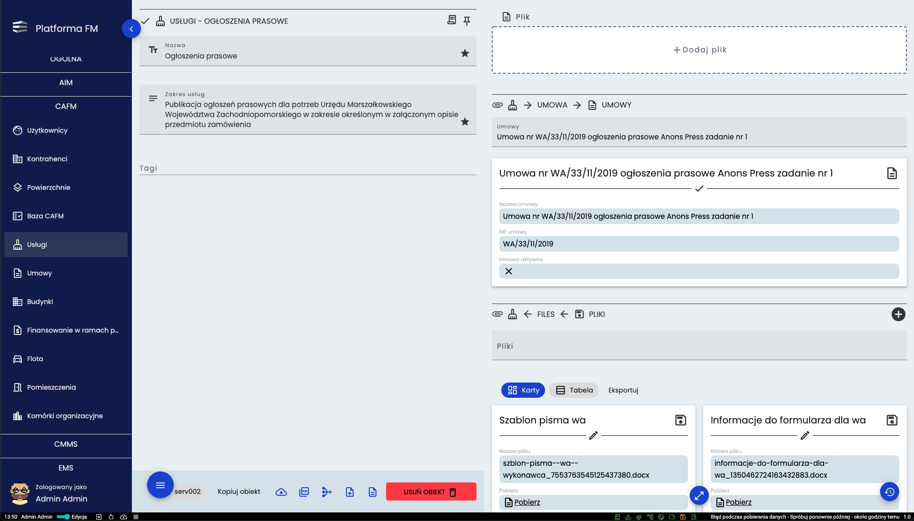
W szczegółach danej usługi po lewej stronie dostępny jest jej zakres, zaś po prawej stronie znajdują się pliki niezbędne
do realizacji tych usług (np. formularze, cenniki czy umowy)

## Umowy
Moduł “Umowy” jest istotną częścią systemu i stanowić może zbiór umów wiążących usługi opisywane w różnych modułach
Platformy FM. Umowy dotyczyć mogą zleceń międzywydziałowych czy kontraktów zawieranych z kontrahentami 
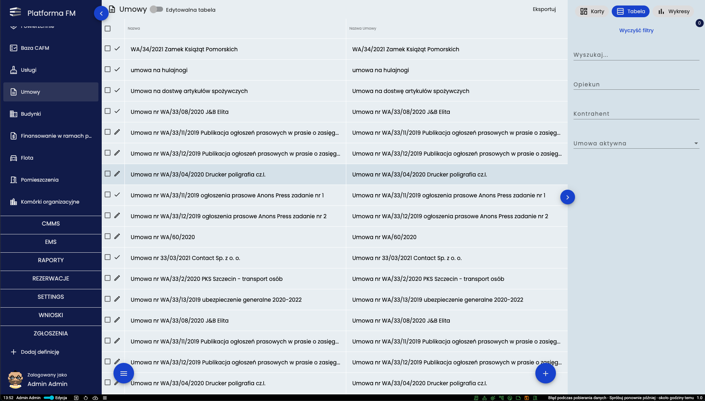
Po otwarciu dowolnej umowy otwarte zostanie okno w którym po lewej stronie dostępne są podstawowe informacje takie jak
numer umowy, czas trwania umowy czy jej zakres. Po prawej stronie widoczne jest kto jest za nią odpowiedzialny i z jakim
kontrahentem została zawarta. Widok przykładowej karty umowy zaprezentowano na kolejnym obrazie.
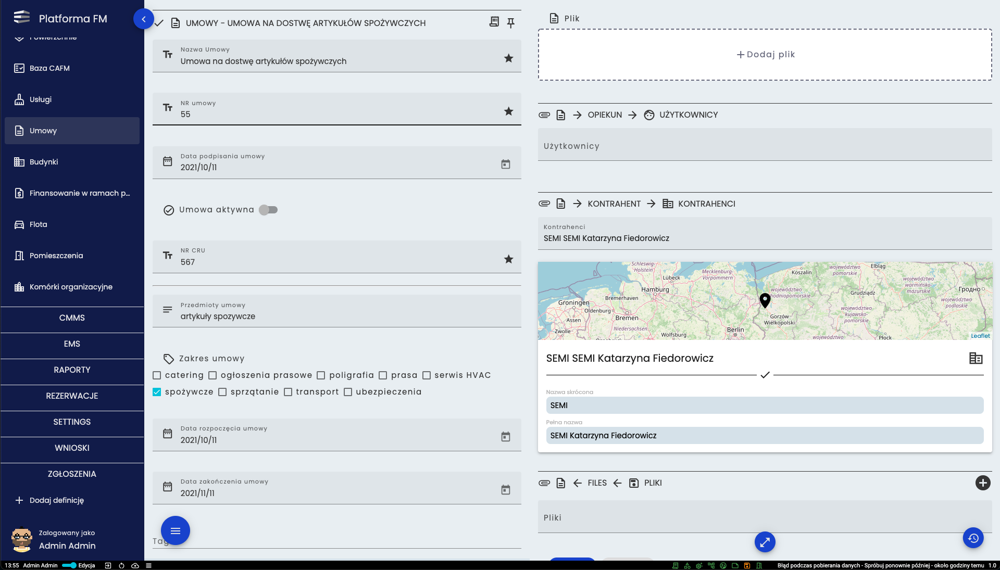

## Budynki
Moduł “Budynki” to kolejny element systemu który opisuje wszystkie lokalizacje w których realizowana jest praca z
Platformą FM.
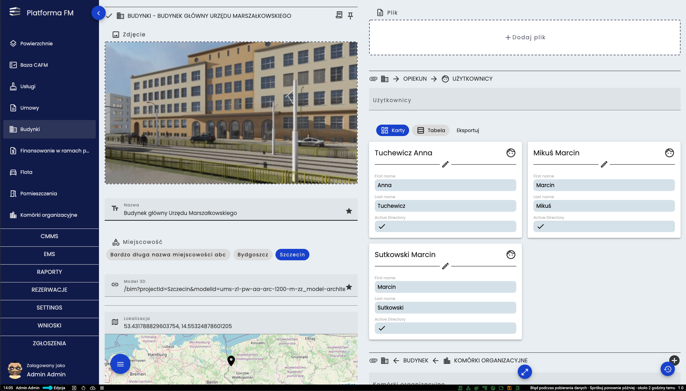
W szczegółach budynku po lewej stronie sprawdzić można jego podstawowe informacje takie jak na przykład adres. Po prawej
stronie widoczne są relacje. Tak też znajdują się pomieszczenia danego budynku, komórki organizacyjne czy też opiekunowie.

## Flota
Flota to kolejna baza modułu CAFM. Zawiera ona zestawienie wszystkich samochodów które należą do majątku UMWZP.
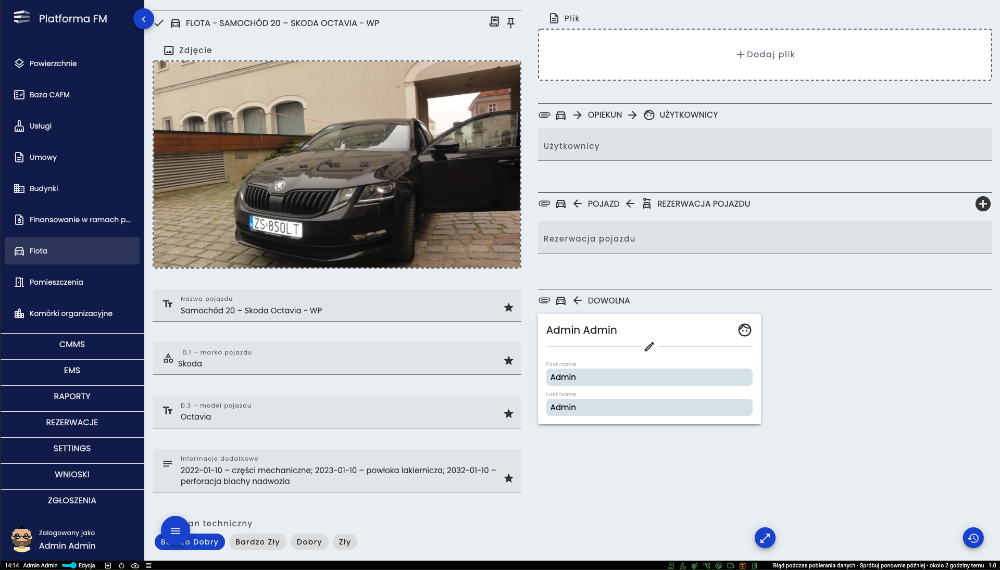
W szczegółach danego pojazdu po lewej stronie znajdują się informacje o między innymi marce, modelu, stanie technicznym
czy przebiegu. Po prawej stronie w relacjach można sprawdzić kto jest opiekunem oraz w jakich okresach dany pojazd jest
zarezerwowany. 

## Pomieszczenia
Moduł “Pomieszczenia” to kolejny element systemu który opisuje wszystkie pomieszczenia znajdujące się w budynkach
objętych nadzorem Platformy FM.
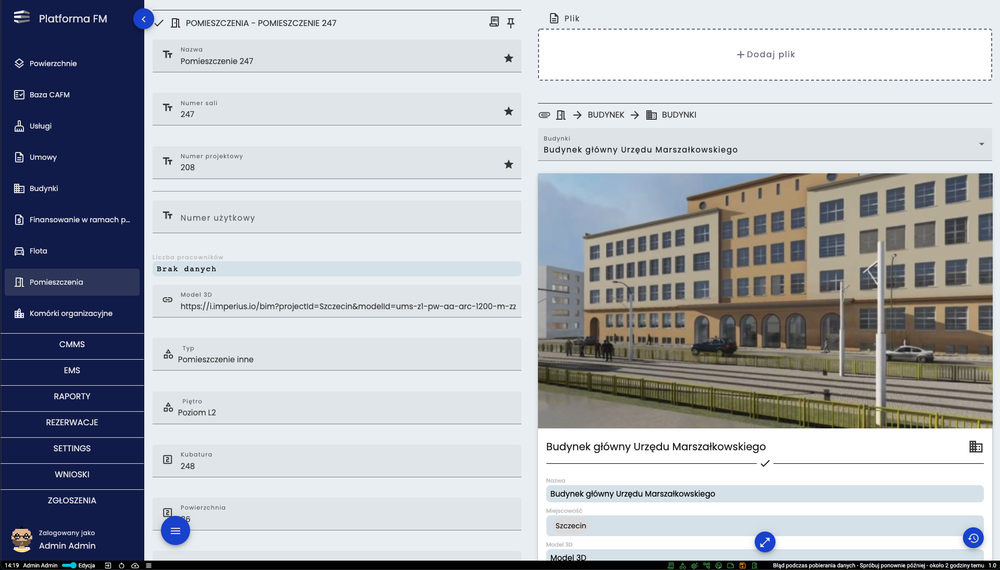
W pomieszczeniu w podstawowych informacjach znajdujących się po lewej stronie można sprawdzić między innymi na którym
piętrze znajduje się to pomieszczenie, jaką ma powierzchnię czy też jakiego jest typu. W relacjach umieszczonych po
prawej stronie można sprawdzić w jakim budynku znajduje się to pomieszczenie, kto jest za nie odpowiedzialny czy też do
jakiej komórki organizacyjnej przynależy.

## Komórki organizacyjne
Ostatnim narzędziem jest struktura organizacyjna nazwana “Komórki Organizacyjne” która prezentowana jest w postaci
rozwijanego drzewa. Za pomocą strzałki (**1.**) można rozwinąć daną komórkę organizacyjną i zobaczyć podległe jej biura.
Klikając w nazwę (**2.**) można przejść do szczegółów danej komórki organizacyjnej lub biura.
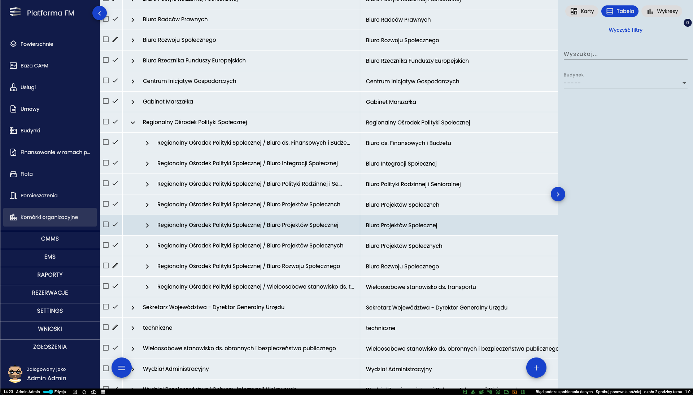
Dane dla narzędzia “Komórki organizacyjne” pobierane są z bazy AD. Dane prezentowane są w sposób hierarchiczny.
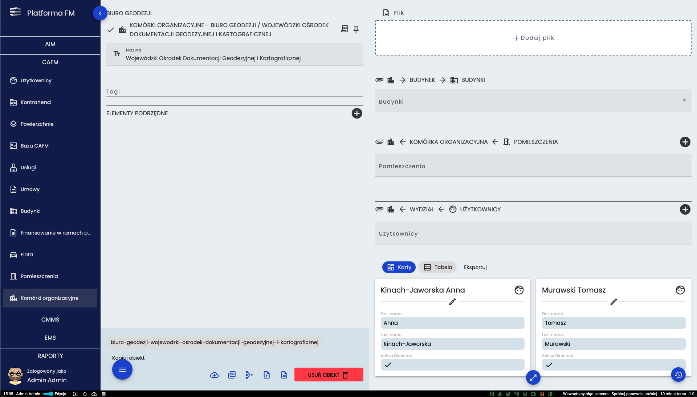
W szczegółach wydziału po lewej stronie widoczna jest nazwa i hierarchia danego wydziału. Po prawej w relacjach można
sprawdzić jacy użytkownicy i jakie pomieszczenia są przypisane do tego wydziału.
