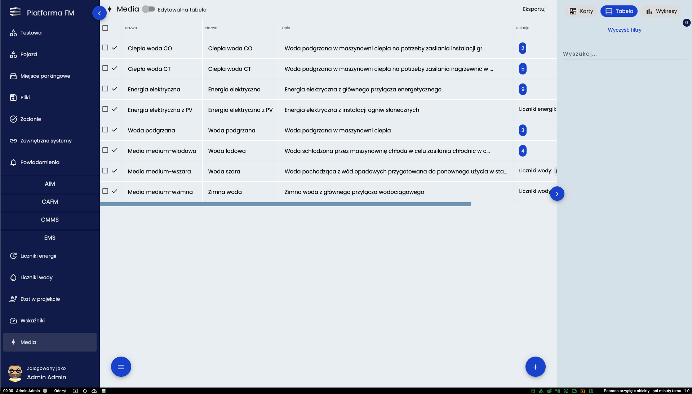
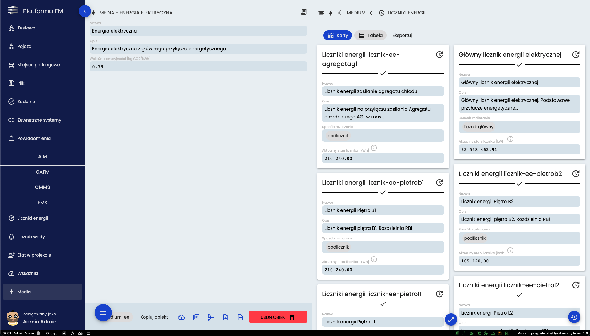
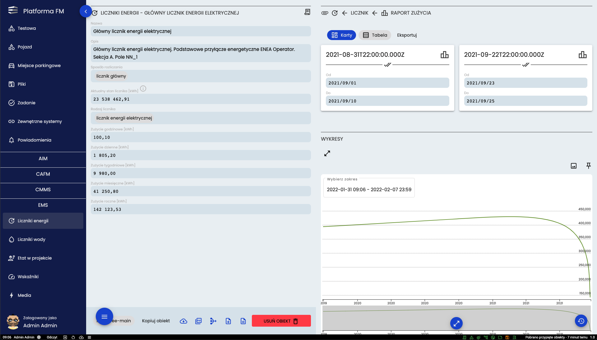
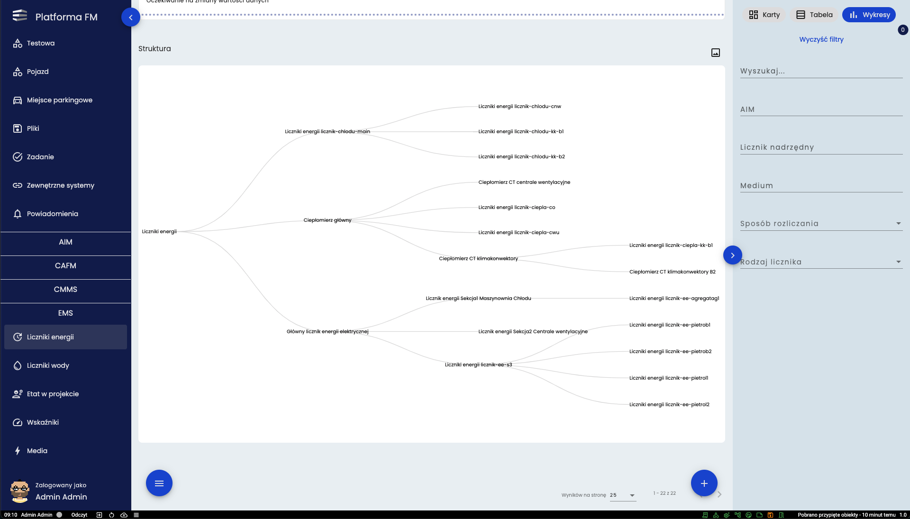
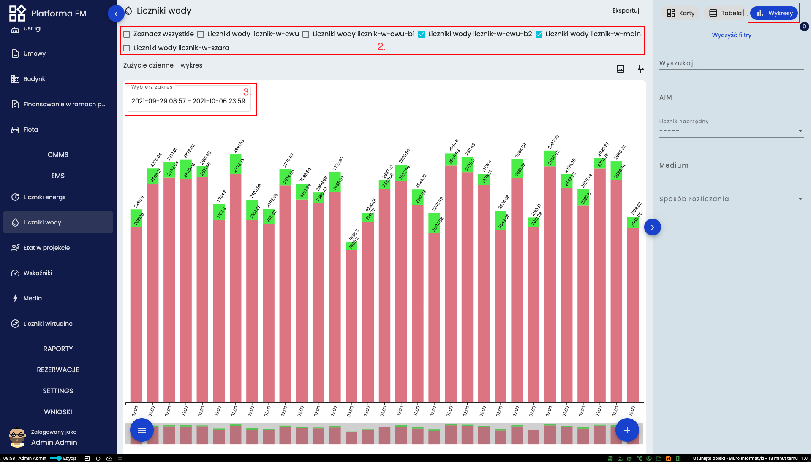
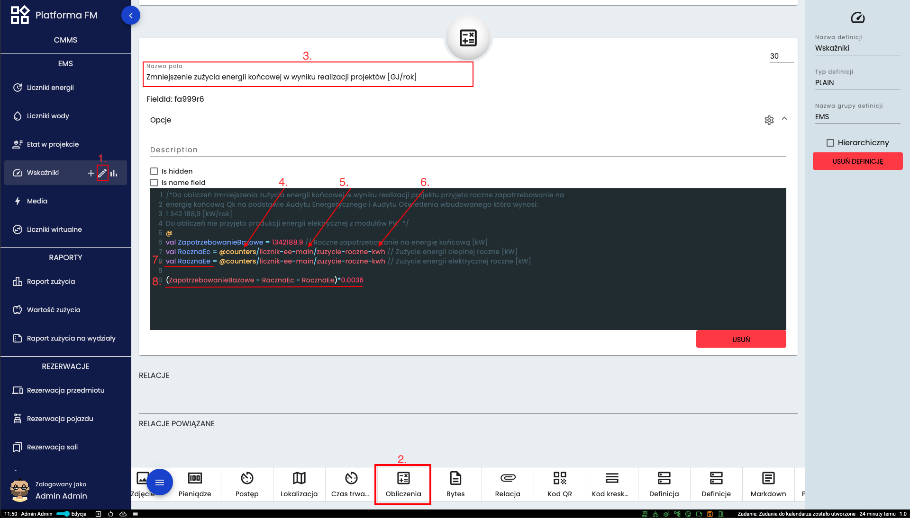

# Moduł EMS

## Media
Istotną częścią modułu EMS jest opis systemu dystrybucji mediów zawarty w narzędziu Media. Zawiera on informacje o
wszystkich rodzajach mediów wykorzystywanych w budynkach UMWZP wraz z najważniejszymi informacjami. Poniższy obraz
prezentuje przykładowe zestawienie mediów

Każdy wpis posiada szczegółową kartę w której znajdują się szczegółowe informacje o mediach energetycznych i wodzie oraz
relacje do wszystkich liczników które biorą udział w rozliczaniu danego media (Prawa strona karty). Poniższy obraz
prezentuje przykładową kartę media energetycznego.

Powiązane po prawej stronie karty Liczniki pomiarowe również posiadają swoje karty w systemie. Można je otworzyć za
pośrednictwem powyższej karty lub wchodząc w podmenu “Liczniki Energii” lub “Liczniki wody”. Poniżej przedstawiono
przykładową kartę licznika energii
## Liczniki

Karty Liczników energii oraz karty liczników wody poza podstawowymi elementami prezentują przeliczenia godzinowe,
dzienne, tygodniowe, miesięczne i roczne dla zużyć energii i wody. Dane te mogą być prezentowane na wykresach liniowych
bądź słupkowych.
Każdy licznik posiadać może relację do licznika podrzędnego i licznika nadrzędnego co pozwala rysować strukturę przepływu
mediów. Struktura ta jest prezentowana po kliknięciu na przycisk “Wykresy” w zestawieniu zbiorczym liczników. Taka
struktura zaprezentowana została na poniższym obrazie.

Użytkownik znajdujący się w zestawieniu liczników ma możliwość generowania wykresów porównawczych jak pokazano na
poniższej ilustracji.

Wyświetlanie widoku następuje po wejściu w definicję i naciśnięciu przycisku (**1.**) włączającego wykresy. U góry strony
jest lista (**2.**) na której należy wybrać jakie obiekty mają zostać wyświetlone na wykresach. Przy wykresie znajduje
się pole (**3.**) gdzie można wybrać zakres dat z jakich dane mają być wyświetlane. Jeśli w danej definicji dodane było
więcej wykresów to pojawiają się one jeden pod drugim i należy zjechać w dół strony, aby zobaczyć kolejne.
Ilość typów wykresów które mogą być prezentowane w tym miejscu konfigurowana jest przez użytkowników z odpowiednimi
uprawnieniami w następujący sposób.
### Tworzenie wykresu

Aby dodać nowy wykres należy najechać kursorem na nazwę definicji a następnie kliknąć ikonę wykresu (**1.**) Na dole
strony (**2.**) pokazane są wszystkie rodzaje dostępnych wykresów. Po kliknięciu w któryś rodzaj pojawi się karta (**3.**). Należy w niej wprowadzić nazwę wykresu (**4.**), wybrać czy wykres ma dotyczyć jednego czy wielu obiektów (**5.**) jak
i wybrać z jakiego pola (**6.**) wartości mają się pojawiać na wykresie.
## Wskaźniki 
W module EMS znajduje się także narzędzie wirtualnych wskaźników których przykład został przedstawiony na kolejnej
ilustracji

Dodawanie nowych obliczeń występuje w menu edycji (**1.**) po dodaniu nowego pola (**2.**) W karcie trzeba uzupełnić
nazwę (**3.**) a poniżej znajduje się  okno na wprowadzenie obliczeń. Dostęp do konkretnego pola następuje poprzez
wprowadzenie ścieżki ID definicji (**4.**)/ ID obiektu (**5.**)/ ID pola (**6.**). Deklaracja zmiennej polega na dodaniu
“val” i nazwy zmiennej (**7.**) Przykładowe obliczenie widoczne na na końcu karty (**8.**)
